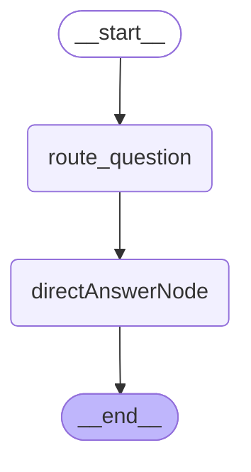

```mermaid
graph TD;
        __start__([<p>__start__</p>]):::first
        route_question(route_question)
        directAnswerNode(directAnswerNode)
        __end__([<p>__end__</p>]):::last
        __start__ --> route_question;
        directAnswerNode --> __end__;
        route_question --> directAnswerNode;
        classDef default fill:#f2f0ff,line-height:1.2;
        classDef first fill-opacity:0;
        classDef last fill:#bfb6fc;
```