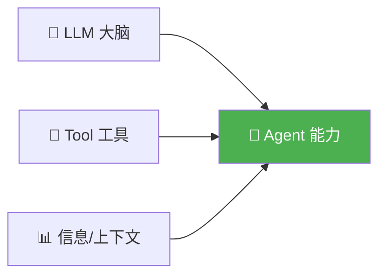
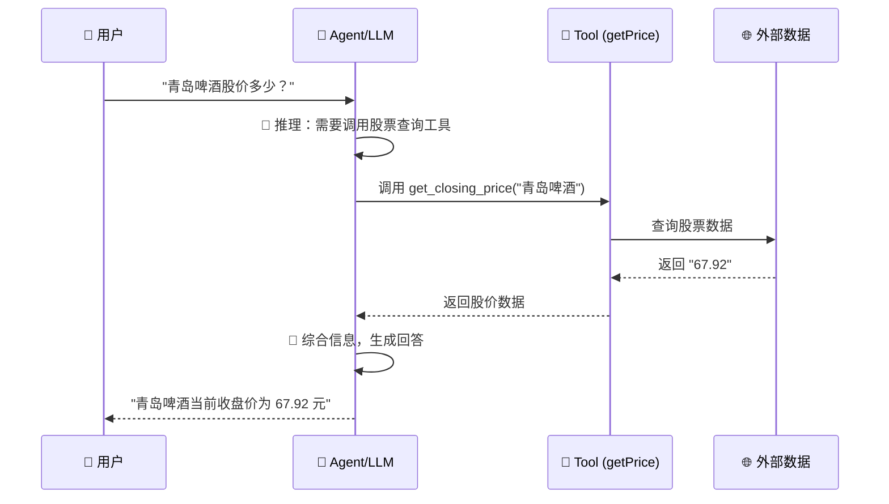
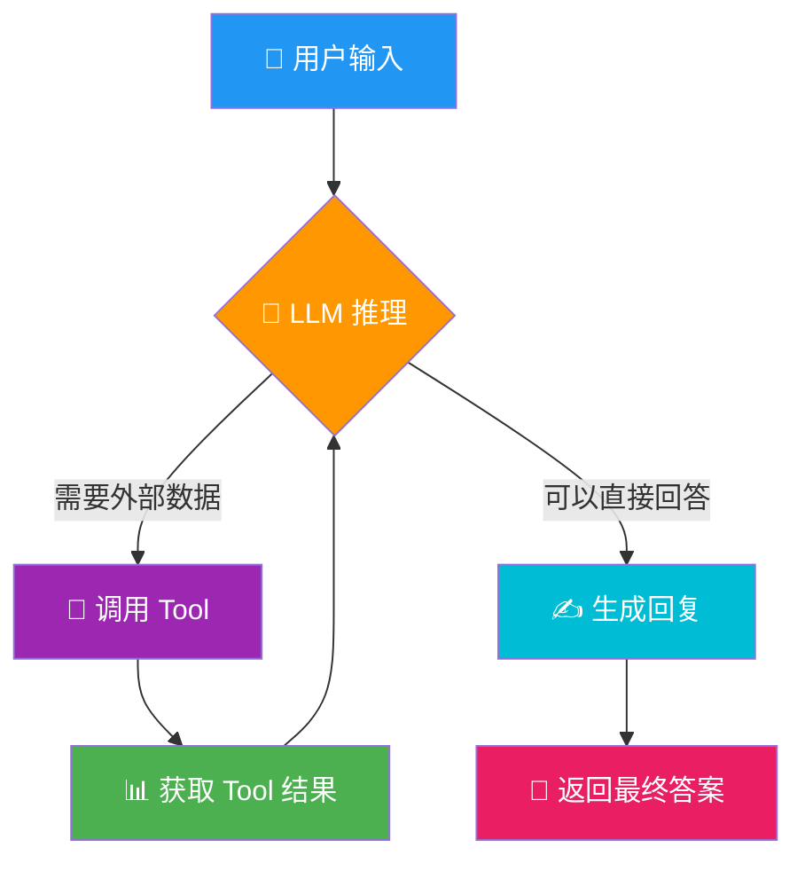

# 🤖 入手 AI Agent，需要搞懂哪几个关键概念？

> 从零开始，一文搞懂 Agent、LLM、Tool、Reasoning 四大核心概念，并附可运行的代码示例。

---

## 📖 目录

- [🧠 1. Agent — 能干活的 AI](#-1-agent--能干活的-ai)
- [🧬 2. LLM — Agent 的大脑](#-2-llm--agent-的大脑)
- [🔧 3. Tool — 连接外部世界的桥梁](#-3-tool--连接外部世界的桥梁)
- [💭 4. Reasoning — 让 AI 学会"思考"](#-4-reasoning--让-ai-学会思考)
- [💬 5. Messages — 多轮对话的基石](#-5-messages--多轮对话的基石)
- [🚀 6. 实战：搭建你的第一个 Agent](#-6-实战搭建你的第一个-agent)
- [📊 7. 总结：一张图看懂 Agent 架构](#-7-总结一张图看懂-agent-架构)

---

## 🧠 1. Agent — 能干活的 AI

**Agent（智能体）** 是当下 AI 领域最炙手可热的概念。Agent 工程师已经取代传统软件工程师，成为薪资天花板最高的岗位之一。

### 什么是 Agent？

简单说，Agent 就是**能帮你干活的 AI**。它不只是回答问题，还能：

| 能力 | 说明 |
|------|------|
| 📂 读文件 | 读取本地文档、代码 |
| 🌐 搜网络 | 实时联网获取最新信息 |
| 💻 写代码 | 生成并执行代码 |
| 🖥️ 操作电脑 | 控制浏览器、桌面应用 |

你现在用的很多产品，本质已经是 Agent：

```
Cursor → 帮你写代码的 Agent
Claude Code → 终端里的编程 Agent
豆包 / 悟空 → 字节系的 AI 助手 Agent
飞书 CLI → 办公场景的 Agent
```

### 🏗️ Agent 的强弱由什么决定？



> 💡 **一个 Agent 有多强？取决于用了什么大脑（LLM），装了什么工具，拿到了什么信息。**

---

## 🧬 2. LLM — Agent 的大脑

**LLM（Large Language Model，大语言模型）** 是 Agent 的核心引擎，负责**推理**和**生成**。

| 厂商 | 代表模型 |
|------|----------|
| 🏢 Anthropic | Claude 系列（Opus / Sonnet / Haiku） |
| 🏢 字节跳动 | 豆包大模型 |
| 🏢 DeepSeek | DeepSeek-V4 系列 |
| 🏢 OpenAI | GPT 系列 |

### ⚠️ LLM 的边界

```
LLM 只负责 → 🧠 推理 + ✍️ 生成
真正的行动能力 → 🔧 来自 Tool 的调用
```

没有 Tool，LLM 只能"空想"，无法完成自动化任务。

---

## 🔧 3. Tool — 连接外部世界的桥梁

这是 Agent 最关键的能力扩展机制。LLM 本身无法对接外部世界，**Tool 补齐了操作短板**。

### 🎯 一个经典场景

> 用户问："青岛啤酒股价多少？"



### 📝 代码实现

#### Step 1 — 定义 Tool

```javascript
// index.mjs — 声明 Agent 可用的工具列表
const tools = [
  {
    type: "function",         // Tool 的标准格式：函数

    function: {
      name: "get_closing_price",
      // ⬇️ 这个 description 是 LLM 理解工具用途的核心
      // 写得好不好，直接决定 LLM 能否准确调用
      description: "获取指定股票的收盘价",

      parameters: {
        type: "object",
        properties: {
          name: {
            type: "string",
            description: "股票名称"   // NLP 友好：LLM 据此理解参数含义
          }
        },
        required: ["name"]
      }
    }
  }
];
```

#### Step 2 — 实现具体函数

```javascript
// 实际的 Tool 实现
function get_closing_price(name) {
  if (name === "青岛啤酒") return "67.92";
  if (name === "贵州茅台") return "1488.21";
  return "未找到股票";
}
```

#### Step 3 — 发起带 Tool 的请求

```javascript
const send_message = async (messages) => {
  return await client.chat.completions.create({
    model: "deepseek-v4-flash",
    messages,
    tools,              // 🔑 关键：把工具列表传给 LLM
    tool_choice: "auto" // LLM 自行判断是否需要调用工具
  });
};

const main = async () => {
  let messages = [
    { role: "user", content: "青岛啤酒的收盘价是多少？" }
  ];

  const response = await send_message(messages);
  const message = response.choices[0].message;
  console.log(message);
};

main();
```

### 🔄 完整调用流程

```
1️⃣ 用户提问  →  "青岛啤酒股价多少？"
2️⃣ LLM 推理  →  "这需要查股价，我要调用 get_closing_price 工具"
3️⃣ Tool 执行 →  返回 "67.92"
4️⃣ 结果回传  →  交给 LLM 再做一次 completion
5️⃣ 最终回答  →  "青岛啤酒当前收盘价为 67.92 元"
```

> 🔑 **核心要点**：LLM 负责理解用户意图并决定调用哪个 Tool、传什么参数；Tool 负责真正执行操作。两者配合，Agent 才能"说"也能"做"。

---

## 💭 4. Reasoning — 让 AI 学会"思考"

**Reasoning（推理）** 是新一代 LLM 的核心能力。它让模型在给出最终答案之前，先进行**深度思考**，并把这个思考过程暴露给我们。

### 🎛️ 关键参数

| 参数 | 含义 | 示例值 |
|------|------|--------|
| `reasoning_effort` | 推理深度 | `"high"` / `"medium"` / `"low"` |
| `reasoning_content` | 思考过程文本 | 模型输出中的思考链 |

### 🧪 代码示例：开启深度推理

```javascript
// main.mjs — 深度推理模式下的多轮对话
import client from "./client.mjs";

const main = async () => {
  const result = await client.chat.completions.create({
    model: "deepseek-v4-pro",
    reasoning_effort: "high",    // 🔑 开启深度推理模式
    messages: [
      {
        role: "system",
        content: "你是一个足球领域的专家，请尽量帮我回答与足球相关的问题",
      },
      {
        role: "user",
        content: "C罗是哪个国家的足球运动员？",
      },
      {
        role: "assistant",
        content: "C罗是葡萄牙的足球运动员",
      },
      {
        role: "user",
        content: "内马尔呢？",
      },
    ],
  });

  console.log("思考过程：");
  console.log(result.choices[0].message.reasoning_content);
  // 👆 这里能看到模型是怎么一步步推理的

  console.log("\n最终答案：");
  console.log(result.choices[0].message.content);
  // 👆 这是给用户的最终回答
};

main();
```

### 📤 输出结构

```
思考过程：
用户问的是内马尔的国籍。从前面的对话可知，
用户刚刚问过C罗的国籍，我已回答C罗是葡萄牙人。
现在用户问"内马尔呢？"，结合上下文，是在问
内马尔是哪个国家的足球运动员。内马尔是巴西人...

最终答案：
内马尔是巴西的足球运动员。🇧🇷
```

### 🎯 Reasoning 的价值

| 场景 | 为什么需要 Reasoning |
|------|---------------------|
| 🔢 数学推理 | 分步计算，减少错误 |
| 🧩 复杂逻辑 | 拆解问题，逐层分析 |
| 🔍 调试追踪 | 开发者能看到 AI 的"心路历程" |
| ✅ 决策验证 | 确认 AI 的推理路径是否正确 |

---

## 💬 5. Messages — 多轮对话的基石

**Messages** 是一个结构化的对话历史数组，每个元素包含 `role` 和 `content`：

```javascript
const messages = [
  { role: "system",    content: "你是一个足球专家" },        // 🎭 设定角色
  { role: "user",      content: "C罗是哪个国家的？" },       // 👤 用户提问
  { role: "assistant", content: "C罗是葡萄牙的足球运动员" }, // 🤖 AI 回答
  { role: "user",      content: "内马尔呢？" },              // 👤 追问
];
```

### 📋 三种角色

| Role | 作用 | 说明 |
|------|------|------|
| 🎭 `system` | 设定 AI 的行为边界 | "你是一个足球专家"、"用中文回答" |
| 👤 `user` | 用户的输入 | 提问、指令 |
| 🤖 `assistant` | AI 的历史回复 | 维持对话上下文 |

> 💡 **关键**：Messages 是 Agent 的"记忆"。每次请求都要把历史对话带上，LLM 才能理解上下文。

---

## 🚀 6. 实战：搭建你的第一个 Agent

### 📁 项目结构

```
reason-demo/
├── .env                 # 🔐 API 密钥（不要提交到 Git！）
├── .gitignore           # 🛡️ 防止密钥泄露
├── client.mjs           # 🔌 LLM 客户端
├── completions.mjs      # 📦 通用补全函数
├── index.mjs            # 🔧 Tool Calling 示例
└── main.mjs             # 💭 Reasoning 示例
```

### 🔌 第一步：初始化客户端

```javascript
// client.mjs — 连接 DeepSeek API
import { OpenAI } from "openai";
import dotenv from "dotenv";
dotenv.config();

const client = new OpenAI({
  apiKey: process.env.DEEPSEEK_API_KEY,       // 从环境变量读取密钥
  baseURL: process.env.DEEPSEEK_API_BASE_URL, // API 地址
});

export default client;  // 默认导出，项目内共享同一个客户端
```

### 🔐 环境变量配置

```bash
# .env — 密钥配置（千万不要提交到 Git！）
DEEPSEEK_API_KEY=sk-xxxxxxxxxxxxxxxxxxxxxxxx
DEEPSEEK_API_BASE_URL=https://api.deepseek.com
DEEPSEEK_MODEL=deepseek-v4-flash
```

### 🛡️ 安全配置

```gitignore
# .gitignore — 防止密钥泄露
.env
.env.local
.env.*

# 编辑器缓存
.idea/
.vscode/

# 依赖
node_modules/
```

### 📦 通用补全函数

```javascript
// completions.mjs — 抽取公共方法
import client from "./client.mjs";

export async function getCompletion(prompt) {
  const response = await client.chat.completions.create({
    model: process.env.DEEPSEEK_MODEL,
    messages: [{ role: "user", content: prompt }],
  });
  return response.choices[0].message.content;
}
```

### 🎯 完整流程图



---

## 📊 7. 总结：一张图看懂 Agent 架构

```
┌─────────────────────────────────────────────────────────┐
│                      🤖 Agent                            │
│                                                          │
│   ┌──────────────┐    ┌──────────────┐                  │
│   │   🧠 LLM     │◄───│  💬 Messages │  对话上下文       │
│   │   推理+生成   │    └──────────────┘                  │
│   └──────┬───────┘                                       │
│          │                                               │
│          │ reasoning_content → 思考过程（可观测）         │
│          │ content           → 最终答案                   │
│          │                                               │
│   ┌──────▼───────┐                                       │
│   │  🔧 Tools    │  函数调用 → 操作外部世界               │
│   │              │                                       │
│   │  • 读文件    │                                       │
│   │  • 搜网络    │                                       │
│   │  • 写代码    │                                       │
│   │  • 查数据    │                                       │
│   └─────────────┘                                        │
└─────────────────────────────────────────────────────────┘
```

### ✨ 核心公式

> **Agent = LLM（大脑）+ Tools（手脚）+ Messages（记忆）+ Reasoning（思维链）**

### 🗺️ 学习路线

```
Step 1: 理解 LLM 是什么，能做什么，不能做什么
   ↓
Step 2: 学会配置 Messages，构建多轮对话
   ↓
Step 3: 掌握 Tool Calling，让 LLM 能调用函数
   ↓
Step 4: 开启 Reasoning，让模型深度思考
   ↓
Step 5: 组合以上能力，构建完整的 Agent 应用
```

---

> 📝 **本文代码** 位于 `reason-demo/` 目录，使用 DeepSeek API（兼容 OpenAI SDK），可直接运行体验。

> ⚠️ **安全提醒**：`.env` 文件包含 API 密钥，请务必将其加入 `.gitignore`，**永远不要提交到版本控制系统**。
