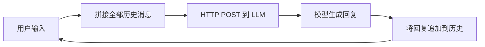

# 🧠 理解 LLM 的无状态架构：从原理到实践

> **TL;DR** — LLM API 本质是**无状态 HTTP 调用**。每次请求都是独立的，模型不记得你上一轮说了什么。"记忆"是我们在客户端手动拼接 `chatHistory` 伪造出来的。本文从架构原理出发，结合可运行 Demo，层层递进地讲清楚这件事。

---

## 📡 一、调用 LLM 接口的本质是什么？

当我们写下一行 `client.chat.completions.create(...)` 时，底层到底发生了什么？

```
┌──────────┐    HTTP POST     ┌──────────────┐     GPU 推理    ┌──────────┐
│  客户端   │  ──────────────> │  LLM API 服务 │  ────────────> │  模型算力  │
│ (你的代码) │  <────────────── │  (DeepSeek /  │  <──────────── │  (GPU 集群) │
└──────────┘    JSON Response  │   OpenAI 等)  │               └──────────┘
                               └──────────────┘
```

**本质就是三次握手后的 HTTP 调用 + 算力生成**。把一堆文本（messages）POST 过去，服务器跑一遍 GPU 推理，然后把生成的文本返回给你。和调用一个 RESTful API 没有本质区别。

这引出了一个关键架构命题：

> 🔑 **为了支持高并发、高可用，后端必须是 Stateless（无状态）的。**

---

## 🌐 二、什么是"无状态"？

### 2.1 HTTP 天然就是无状态的

HTTP 协议本身就是一个**无状态协议**。每一次 GET / POST 请求都是独立的，服务器处理完就忘掉。

```text
GET /api/user/123    →   服务器返回用户数据   →   服务器：完事，忘了
POST /api/chat       →   服务器返回模型回复   →   服务器：完事，忘了
```

那"登录态"是怎么来的？——靠的是 **Header 中的 Cookie / Authorization Token**，由客户端每次主动携带，而不是服务器"记住"了谁。

### 2.2 无状态 vs 有状态

| 维度 | 🟢 无状态 (Stateless) | 🔴 有状态 (Stateful) |
|------|----------------------|----------------------|
| **每次请求** | 独立，不依赖之前请求 | 依赖服务器保存的上下文 |
| **服务器负担** | 低，不需要存客户端信息 | 高，需要维护会话状态 |
| **水平扩展** | ✅ 任意一台服务器都能处理 | ❌ 需要会话亲和性（sticky session） |
| **容错性** | ✅ 一台挂了换一台即可 | ❌ 状态丢失则会话中断 |
| **类比** | 自动售货机：投币→出货→遗忘 | 餐厅服务员：记住每桌点了什么 |

### 2.3 试想 LLM 服务器"有状态"会怎样？

```
用户 A: "我叫小明"    →  服务器 1 记住了
用户 A: "我叫什么？"  →  负载均衡到了服务器 2 → 服务器 2：???
```

如果每台服务器都要维护上百万用户的对话状态，内存直接爆炸，更别提扩缩容、故障转移的噩梦。所以 **LLM API 必须是 Stateless 的**——服务器不保存任何对话上下文。

---

## 🧩 三、那模型是怎么"记住"对话的？

**答案是：它根本没记。** 是**你**每次把全部历史对话拼好，重新发给它。

### 3.1 运行底层规则



三个核心原则：

1. 🚫 **LLM 是无状态的**——它不记得上一轮说了什么
2. 🤝 **想让它"懂"你**——每次手动带上全部对话历史
3. ⚖️ **服务器端并发友好**——请求在任何一台机器上运行都没差别

### 3.2 看代码 👇

下面是一段真实的 Demo，演示了"让模型记住名字"这件事是怎么靠手拼 `chatHistory` 做到的：

```javascript
import OpenAI from 'openai';
import { config } from 'dotenv';
config();

const client = new OpenAI({
  apiKey: process.env.DEEPSEEK_API_KEY,
  baseURL: process.env.DEEPSEEK_API_BASE_URL,
});

// 🔑 核心：历史对话数组，这是我们手动维护的"记忆"
const chatHistory = [
  {
    role: 'system',
    content: '你是一个严谨的助手'
  }
];

async function testStateless() {
  // ──── 第一轮：告诉模型名字 ────
  console.log('📝 第一次请求，告诉模型一个信息');
  chatHistory.push({
    role: 'user',
    content: '请记住，我的名字叫零零发'
  });

  const response = await client.chat.completions.create({
    model: 'deepseek-v4-flash',
    messages: chatHistory  // 👈 把全部历史传过去
  });

  // ⚠️ 关键：模型的回复也要加入历史！
  chatHistory.push({
    role: 'assistant',
    content: response.choices[0].message.content
  });
  console.log('🤖 模型回复:', response.choices[0].message.content);

  // ──── 第二轮：问名字 ────
  console.log('🔍 第二次请求，直接问我是谁？');
  chatHistory.push({
    role: 'user',
    content: '请问我的名字是什么？'
  });

  const response2 = await client.chat.completions.create({
    model: 'deepseek-v4-flash',
    messages: chatHistory  // 👈 再次把全部历史传过去
  });

  chatHistory.push({
    role: 'assistant',
    content: response2.choices[0].message.content
  });
  console.log('🤖 模型回复:', response2.choices[0].message.content);

  // 打印最终的历史数组
  console.log('📦 最终 chatHistory:', JSON.stringify(chatHistory, null, 2));
}

testStateless().catch(err => {
  console.log('❌', err);
});
```

### 3.3 🔴 有状态 vs 🟢 无状态：代码差异一针见血

源码中有一段**被注释掉的代码**，恰好展示了"有状态幻想"和"无状态现实"的对比：

```javascript
const response = await client.chat.completions.create({
  model: 'deepseek-v4-flash',
  // ❌ 有状态的幻想写法（被注释掉了）：
  // messages: [
  //   { role: 'system', content: '你是一个严谨的助手' },
  //   { role: 'user', content: '请记住，我的名字叫零零发' }
  // ]
  // ✅ 无状态的正确写法：
  messages: chatHistory   // 把整个历史数组传过去
});
```

再对比第二轮：

```javascript
const response2 = await client.chat.completions.create({
  model: 'deepseek-v4-flash',
  // ❌ 有状态的幻想写法（被注释掉了）：
  // messages: [
  //   { role: 'user', content: '请问我的名字是什么？' }
  // ]
  // ✅ 无状态的正确写法：
  messages: chatHistory   // 再次把整个历史数组传过去
});
```

一张表看清区别：

| | 🔴 有状态幻想 | 🟢 无状态现实 |
|---|---|---|
| **第一轮发的 messages** | `[system, user-1]` | `[system, user-1]` ← 一样 |
| **第二轮发的 messages** | `[user-2]` ← 只有当前 | `[system, user-1, assistant-1, user-2]` ← **完整历史** |
| **模型知道之前聊了什么吗？** | ❌ 不知道。它只看到"请问我的名字是什么？" | ✅ 知道。它看到了完整的对话链 |
| **服务器的负担** | 😱 需要为每个用户存历史，无法扩展 | 😊 零负担，收到什么处理什么 |
| **为什么这是幻想** | HTTP 是无状态的，服务器不会帮你记住 | 客户端自己维护 `chatHistory`，每次全量携带 |

> 🎯 **核心差异一句话：有状态 = 期望服务器帮你记。无状态 = 你自己记好，每次全量带上。**

`chatHistory` 就是这个"记忆载体"——一个客户端维护的数组，每次请求都完整发送。代码中被注释掉的部分，正是新手最容易踩的坑：**以为上一轮消息服务器已经知道了，这轮只发新消息就行**——实际上那样做模型完全不知道你在说什么。

### 3.4 另一个关键事实

> 💡 **模型回复不加入 `chatHistory` = 模型不知道自己刚才说了什么。**

注意代码中每次 `client.chat.completions.create()` 后，都紧跟着一句：

```javascript
chatHistory.push({
  role: 'assistant',
  content: response.choices[0].message.content
});
```

如果漏掉这一步，下一轮对话中模型就看不到自己上一轮的回复，上下文就断了。这不是模型"记不住"——而是我们根本没把那条消息放进下一轮的 `messages` 里。

---

## ⚠️ 四、`chatHistory` 模式的问题

手拼历史对话虽然能工作，但随着对话增长，问题逐渐暴露：

### 4.1 消息膨胀 → Token 开销指数增长

```
第 1 轮: 2 条消息 (system + user)
第 2 轮: 4 条消息
第 3 轮: 6 条消息
...
第 N 轮: 2N 条消息
```

每轮对话的 Token 消耗 = **前面所有轮次的总和**。聊得越久，单次请求越贵、越慢。

### 4.2 容量天花板

模型都有上下文窗口限制（Context Window）。当 `chatHistory` 超过这个窗口，必须裁切。但简单粗暴地删掉最早的消息，模型就丢失了"早期记忆"。

### 4.3 LRU 缓存策略：一种折中

```
┌─────────────────────────────────────────────┐
│              chatHistory 数组                │
├──────────┬──────────┬──────────┬───────────┤
│ 第1轮对话 │ 第2轮对话 │ 第3轮对话 │ ...第N轮  │
│  (丢弃)   │  (保留)   │  (保留)   │  (保留)   │
└──────────┴──────────┴──────────┴───────────┘
              ↑ Token 容量上限
```

类似 LRU（Least Recently Used）缓存：保留最近聊的，丢弃久远的。但这对**长线任务**是个问题——任务还没完成，早期关键信息就已经被淘汰了。

---

## 🚀 五、演进：从 Prompt 到 Context 到 Loop

LLM 工程能力的升级路径，本质是在**无状态地基**上层层搭建"有状态"的抽象：

| 阶段 | 名称 | 核心思路 | 典型手段 |
|------|------|----------|----------|
| 🥉 L1 | **Prompt Engineering** | 写高质量 Prompt，把上下文塞进 messages | System Prompt、Few-shot、历史对话拼接 |
| 🥈 L2 | **Context Engineering** | 动态检索 + 工具调用，扩展"上下文"边界 | RAG 知识库、MCP 工具、Skill 调用 |
| 🥇 L3 | **Loop Engineering** | 循环编排，把 LLM 嵌入工程流水线 | Agent Harness、自主循环、多步推理 |

### L1 — Prompt Engineering 🎨

当前最普遍的实践。通过精心设计 `system` prompt + 手动维护 `chatHistory` + 知识库文件（如 `CLAUDE.md`、`AGENTS.md`）塞进上下文。

- 优点：简单直接
- 痛点：**像抽卡**——Prompt 质量能提高抽到"金卡"的概率，但不是特别可控

### L2 — Context Engineering 🔧

LLM 的知识有截止日期，也不知道你的私有数据。所以需要：
- **RAG**：检索增强生成，从外部知识库拉相关资料注入上下文
- **MCP / Skill**：让 LLM 调用外部工具，获取实时数据、操作外部系统

### L3 — Loop Engineering ⚙️

当前的前沿方向。把 LLM 嵌入一个**循环编排引擎（Harness）**中：

```
┌─────────────────────────────────────────────┐
│                 Harness (编排引擎)             │
│                                             │
│   ┌──────┐    ┌──────────┐    ┌─────────┐  │
│   │ 思考  │ → │ 执行动作  │ → │ 观察结果 │  │
│   └──────┘    └──────────┘    └─────────┘  │
│        ↑                              ↓     │
│        └────────  循环迭代  ──────────┘     │
└─────────────────────────────────────────────┘
```

每次调 LLM 仍然是无状态的，但 **Harness** 在客户端维护状态、决策循环、工具结果、多轮推理——用工程手段在无状态地基上盖出了有状态的 AI Agent。

---

## 🏁 六、总结

```
                    无状态 LLM 架构全景

    HTTP 协议 (Stateless)
    ═══════════════════════════════════════
    │                                      │
    │  每次请求 = 独立的 POST               │
    │  服务器不保存任何对话上下文            │
    │  可水平扩展，任意服务器都能处理         │
    ═══════════════════════════════════════
                    │
                    │ 之上构建
                    ▼
    ═══════════════════════════════════════
    │  chatHistory 数组                    │
    │  客户端手动维护"记忆"                 │
    │  每轮拼接全部消息再发出去              │
    ═══════════════════════════════════════
                    │
                    │ 之上再构建
                    ▼
    ═══════════════════════════════════════
    │  Context / Loop Engineering          │
    │  RAG + 工具调用 + 循环编排            │
    │  在无状态地基上盖出有状态 Agent        │
    ═══════════════════════════════════════
```

核心认知一句话：

> 🎯 **LLM 没有记忆——你每次带上的 `messages` 数组，就是它的全部世界。**

理解了这个，你就理解了为什么 `chatHistory` 这么重要、为什么 Token 消耗随对话增长、以及为什么所有 AI 工程最终都在围绕"上下文管理"做文章。

---

