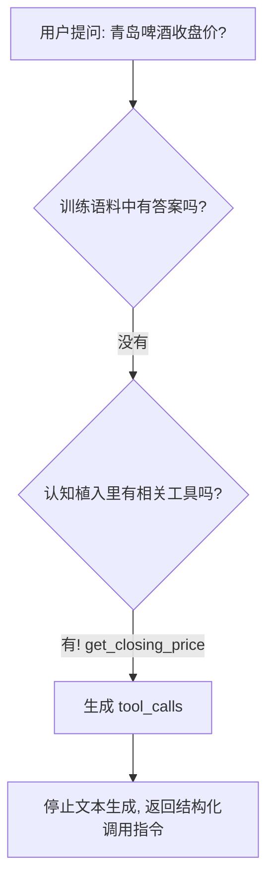
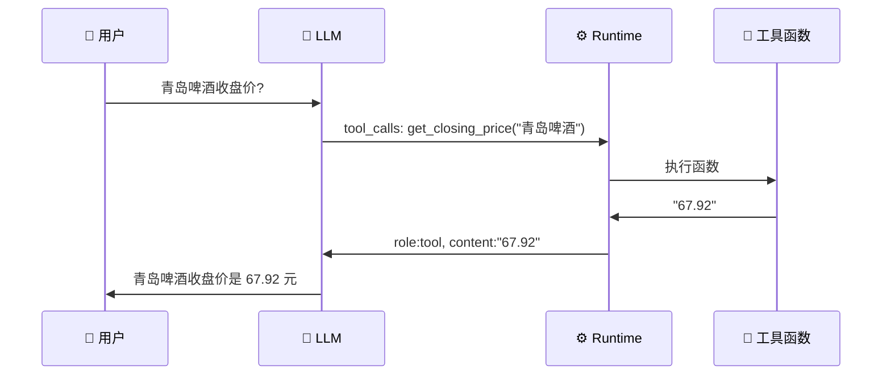

# 🧠 Tool Use 深度解析：LLM 如何"突破"物理限制

> **核心公式：`LLM + Tools = Agent`**
>
> 当 AI 能够搜索网页、分析 Excel、操作电脑时，你看到的并不是「自我意识」，而是一场精心设计的**认知魔术**。本文将拆解这场魔术背后的三步技法。

---

## 📖 目录

1. [🎭 引言：缸中大脑的错觉](#-引言缸中大脑的错觉)
2. [🧬 第一步：认知植入 —— 把工具「降维」为语言](#-第一步认知植入--把工具降维为语言)
3. [🎯 第二步：意图识别 —— LLM 的「自言自语」](#-第二步意图识别--llm-的自言自语)
4. [⚙️ 第三步：Runtime 介入 —— 真正的执行者](#-第三步runtime-介入--真正的执行者)
5. [🧪 完整示例：从代码看全流程](#-完整示例从代码看全流程)
6. [🔁 全流程回顾](#-全流程回顾)
7. [💡 总结：为什么说这是一场「错觉」](#-总结为什么说这是一场错觉)

---

## 🎭 引言：缸中大脑的错觉

想象一个场景：

- 🫘 豆包可以**自动搜索网页**，告诉你最新的新闻
- 📊 Claude 可以**分析 Excel 表格**，生成洞察报告
- 🖥️ AI Agent 可以**操作你的电脑**，帮你整理文件

用户惊叹：**「AI 也太聪明了吧！」**

但作为开发者，我们知道一个残酷的事实：

> ⚠️ **那个在显卡里疯狂跑的 LLM，本质上还是个「词语接龙」游戏。它是被困在服务器里的「缸中大脑」——它看不见屏幕，摸不到键盘，更不可能真正「做」任何事情。**

一个只能做 **Next Token Prediction**（下一个词预测）的概率模型，是怎么「突破物理限制」去调用 API、读数据库、操作物理世界工具的？

答案藏在三个精妙的步骤里。

---

## 🧬 第一步：认知植入 —— 把工具「降维」为语言

### 🎯 核心思想

> **大模型不懂什么是 API，但它听得懂语言。**

在任务开始之前，当我们把工具配置写入 System Prompt 时，一件极其精妙的事情正在发生——**「认知植入」**。

### 📐 怎么做：JSON Schema 作为「说明书」

我们把复杂的软件接口，翻译成大模型能理解的**使用说明书**——JSON Schema：

```json
{
  "type": "function",
  "function": {
    "name": "get_closing_price",
    "description": "获取指定股票的收盘价",
    "parameters": {
      "type": "object",
      "properties": {
        "name": {
          "type": "string",
          "description": "股票名称"
        }
      },
      "required": ["name"]
    }
  }
}
```

> 💡 **一个复杂的软件工具（如 `get_closing_price`），在这个阶段被「降维」成了一个纯粹的文本描述。**

LLM 不需要知道这个函数是怎么实现的——它只需要知道：

| 字段 | 含义 | 作用 |
|------|------|------|
| `name` | 函数名 | 我该调用谁 |
| `description` | 函数描述 | 这个工具是干什么的 |
| `parameters` | 参数定义 | 调用时需要传什么 |
| `required` | 必填项 | 哪些参数必须提供 |

### ⚠️ 关键细节

LLM 的输出本质上是**概率随机**的，这意味着：

- 工具描述必须**具体清晰** —— 「获取指定股票的收盘价」比「获取价格」好十倍
- JSON Schema 的约束要**精确** —— 字段类型、必填项、描述一个都不能含糊
- 这就像给一个盲人写导航指令，每一步都必须**明确无误**

---

## 🎯 第二步：意图识别 —— LLM 的「自言自语」

### 🔍 发生了什么

当用户问：**「青岛啤酒的收盘价是多少？」**

LLM 的推理引擎开始了一场快速的内部评估：



### 📤 LLM 的输出

LLM **不会**执行这个工具——它只是生成了一段结构化的「调用请求」：

```json
{
  "role": "assistant",
  "content": null,
  "tool_calls": [
    {
      "id": "call_abc123",
      "type": "function",
      "function": {
        "name": "get_closing_price",
        "arguments": "{\"name\": \"青岛啤酒\"}"
      }
    }
  ]
}
```

> 🎯 **这是整个魔术最精妙的时刻**：LLM 停下了和你的对话，开始「自言自语」。它严格按照认知植入阶段的「说明书」，生成了一段精确的调用代码。它**赌**这段代码发出后，会有人响应。

### 🔑 关键洞察

| 你以为的 | 实际发生的 |
|---------|-----------|
| AI 去查了股票数据 | AI 只是输出了一段 JSON |
| AI 知道股价是多少 | AI 只是推测了该调用哪个函数 |
| AI 有自主行动能力 | AI 依赖模式识别和逻辑推理 |

LLM 能做到的，是基于强大的**模式识别**能力，判断「这个问题我回答不了，但我有一个工具可以用」。剩下的事情，交给 Runtime。

---

## ⚙️ 第三步：Runtime 介入 —— 真正的执行者

### 🖥️ 谁来执行？

**Runtime** —— 运行在 Node.js / Python / Java 等传统环境中的代码。它是真正「动手」的那一方：



### 🔄 Runtime 的职责

Runtime 只做一件事：**接收 tool_calls → 执行 → 返回结果给 LLM**

```
📥 输入：LLM 生成的 tool_calls
📤 输出：工具执行结果（以 tool role 的形式回传给 LLM）
```

注意：**执行结果不是直接返回给用户的**，而是返回给 LLM。LLM 作为「用户交互接口」，拿到结果后，结合上下文，生成最终的自然语言回复。

---

## 🧪 完整示例：从代码看全流程

下面是 `demo/index.mjs` 的完整实现，我们分段解读：

### 🔌 1. 初始化：连接缸中大脑

```javascript
import OpenAI from 'openai';
import dotenv from 'dotenv';
dotenv.config();

// 🧠 缸中大脑 —— LLM 被困在服务器里
const client = new OpenAI({
  apiKey: process.env.DEEPSEEK_API_KEY,
  baseURL: process.env.DEEPSEEK_BASE_URL
});
```

### 🧬 2. 认知植入：工具降维为语言

```javascript
// 📐 tools 配置 —— JSON Schema
// 将函数「降维」为 LLM 能理解的语言描述
const tools = [
  {
    "type": "function",
    "function": {
      "name": "get_closing_price",
      "description": "获取指定股票的收盘价",  // ← LLM 决策的依据
      "parameters": {
        "type": "object",
        "properties": {
          "name": {
            "type": "string",
            "description": "股票名称"
          }
        },
        "required": ["name"]
      }
    }
  },
  {
    type: 'function',
    function: {
      name: 'get_weather',
      description: '获取指定城市的天气',
      parameters: {
        type: 'object',
        properties: {
          city: {
            type: 'string',
            description: '城市名称'
          }
        },
        required: ['city']
      }
    }
  }
];
```

### 🔧 3. 传统函数：Runtime 执行的真实工具

```javascript
// ⚙️ 传统软件世界 —— 真正的执行者
function get_closing_price(name) {
  if (name === '青岛啤酒') {
    return '67.92';
  } else if (name === '贵州茅台') {
    return '1488.21';
  } else {
    return '未找到该股票';
  }
}
```

### 📡 4. LLM 调用：意图识别

```javascript
async function sendMessage(messages) {
  const res = await client.chat.completions.create({
    model: 'deepseek-v4-pro',
    messages,
    tools,              // ← 注入「认知」
    tool_choice: 'auto' // ← 让 LLM 自己决定要不要用工具
  });
  return res;
}
```

### 🔁 5. 主流程：三步协作

```javascript
async function main() {
  let messages = [
    { role: 'user', content: '青岛啤酒的收盘价是多少？' }
  ];

  // 📍 第一轮：LLM 意图识别 —— 生成 tool_calls
  const response = await sendMessage(messages);
  const message = response.choices[0].message;
  console.log('模型返回 message 对象', JSON.stringify(message));

  // 保存 LLM 的「思考结果」到对话历史
  messages.push({
    role: message.role,
    content: message.content,
    tool_calls: message.tool_calls
  });

  // ⚙️ Runtime 介入 —— 执行真正的函数
  if (response.choices[0].message.tool_calls) {
    const toolCall = response.choices[0].message.tool_calls[0];

    if (toolCall.function.name === 'get_closing_price') {
      const args = JSON.parse(toolCall.function.arguments);
      const price = get_closing_price(args.name);  // ← 真正执行
      console.log('股票收盘价', price);

      // 将执行结果以 tool role 回传
      messages.push({
        role: 'tool',
        content: price,
        tool_call_id: toolCall.id  // 🔗 用 id 关联，支持多工具并行
      });

      console.log('更新后完整对话上下文:', messages);

      // 📍 第二轮：LLM 根据结果生成最终回复
      const finalRes = await sendMessage(messages);
      console.log('最终模型返回',
        finalRes.choices[0].message.content
      );
    }
  }
}

main();
```

---

## 🔁 全流程回顾

把整个流程串起来看，每一次 Tool Use 都经历了**两轮 LLM 调用 + 一次 Runtime 执行**：

```
┌─────────────────────────────────────────────────────────────┐
│  用户: "青岛啤酒的收盘价是多少？"                              │
│                                                             │
│  ① 🧬 认知植入 (事前完成)                                    │
│     tools 配置已注入 LLM 上下文                               │
│                                                             │
│  ② 🎯 意图识别 (第一轮 LLM 调用)                              │
│     LLM → tool_calls: get_closing_price("青岛啤酒")          │
│                                                             │
│  ③ ⚙️ Runtime 介入                                          │
│     get_closing_price("青岛啤酒") → "67.92"                  │
│     结果以 tool role 回传                                     │
│                                                             │
│  ④ 🗣️ 最终回复 (第二轮 LLM 调用)                              │
│     LLM: "青岛啤酒的收盘价是 67.92 元"                        │
└─────────────────────────────────────────────────────────────┘
```

| 轮次 | 角色 | 动作 | 产物 |
|------|------|------|------|
| 准备阶段 | 开发者 | 定义 tools（JSON Schema）| 认知植入完成 |
| 第一轮 | LLM | 意图识别，生成 tool_calls | `{name: "get_closing_price", arguments: {...}}` |
| 中断执行 | Runtime | 解析 tool_calls，执行函数 | `"67.92"` |
| 第二轮 | LLM | 接收 tool 结果，生成自然语言 | `"青岛啤酒的收盘价是 67.92 元"` |

---

## 💡 总结：为什么说这是一场「错觉」

### 🎭 魔术的三个秘密

| 步骤 | 用户看到的 | 实际发生的 |
|------|-----------|-----------|
| 认知植入 | AI「知道」怎么查股票 | 开发者把函数翻译成了 JSON 说明书 |
| 意图识别 | AI「决定」去查股票 | LLM 概率推理出该调用哪个工具 |
| Runtime 介入 | AI「查到」了股票价格 | 传统代码执行了函数，结果喂回给 LLM |

### 🧱 本质：LLM 从未「突破」物理限制

> **LLM 始终是一个文本预测模型。它既没有「执行」任何代码，也没有「访问」任何外部系统。**

它只是学会了——当遇到自己无法回答的问题时，**输出一种特殊的结构化文本（tool_calls）**，等待一个外部的 Runtime 去执行并将结果返还给它。然后它再将这些结果「编织」成自然的语言回复。

这就是 **LLM + Tools = Agent** 的底层真相：

```
一个不会执行的「大脑」 + 一个不会思考的「身体」 = 一个看似全能的 Agent
```

作为开发者，理解这三步，你就理解了当代 AI Agent 的**全部核心范式**。

---

> 📁 相关代码：[demo/index.mjs](demo/index.mjs) | 原始笔记：[readme.md](readme.md)
