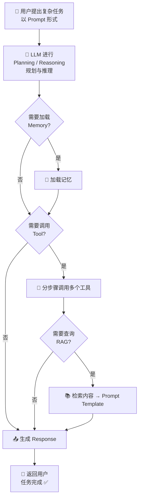
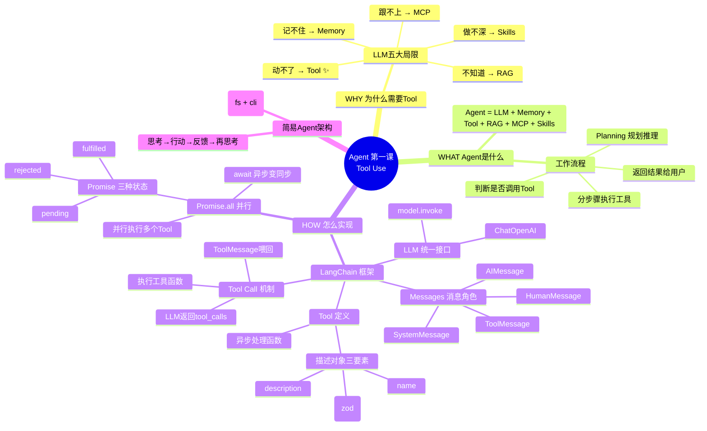

# 🤖 Agent 智能体开发实战 · 第一课：Tool Use —— 让大模型自动干活

> **系列定位**：从零开始，循序渐进，用代码说话，打造自己的 AI Agent。
>
> **本课聚焦**：LLM 为什么要装"手"？Tool 怎么定义？LLM 怎么调用 Tool？如何并行执行多个 Tool？

---

## 🗺️ 全系列路线图

```
Agent 学习路线（Node.js + LangChain 技术栈）

┌──────────────────────────────────────────────────────────┐
│  第一课 ✅     Tool Use        让大模型自动干活            │
│  第二课 📝     Agent Loop      完整的思考-执行循环         │
│  第三课 🧠     Memory          给 Agent 装上记忆           │
│  第四课 📚     RAG             检索增强生成               │
│  第五课 🔌     MCP             标准化的工具协议            │
│  第六课 🎯     Skills          复杂任务的技能编排          │
│  第七课 🕸️     LangGraph       多智能体协作               │
│  第八课 🏭     NestJS 集成      AI 全栈产品落地           │
└──────────────────────────────────────────────────────────┘
```

> 💡 每一课都有对应的可运行代码，放在 `hello-langchain/` 目录下。

---

## 📖 本课目录

- [一、为什么不直接调用大模型接口？](#一为什么不直接调用大模型接口)
- [二、Agent 到底是什么？](#二agent-到底是什么)
- [三、Agent 的工作流程](#三agent-的工作流程)
- [四、Agent 开发框架 —— LangChain](#四agent-开发框架--langchain)
- [五、LangChain 核心模块详解](#五langchain-核心模块详解)
  - [5.1 LLM：统一的大模型接口](#51-llm统一的大模型接口)
  - [5.2 Tool：给 LLM 装上"手"](#52-tool给-llm-装上手)
  - [5.3 Tool 的返回格式与交互机制](#53-tool-的返回格式与交互机制)
- [六、LLM + Tool 性能优化：Promise.all 并行执行](#六llm--tool-性能优化promiseall-并行执行)
- [七、手写一个简易版 Claude Code Agent](#七手写一个简易版-claude-code-agent)
- [八、本课小结 & 下节预告](#八本课小结--下节预告)

---

## 一、为什么不直接调用大模型接口？

很多人以为搞 AI 应用就是调一下 OpenAI 的 API，但实际上，**裸调大模型接口有几个硬伤**：

| 🚫 问题 | 💡 解释 | 🔧 解决方案 |
|---------|---------|-------------|
| **记不住** | 你上周和它聊过的消息，它能记住吗？LLM 是 **stateless（无状态）** 的，每次请求都是"初次见面" | 数据库 / 前端存储 / Redis → **Memory 模块** |
| **动不了** | 让 LLM 帮你访问一个网页、操作文件？它只能告诉你思路，没法自己动手 | **Tool Use 模块** ✨ **本课重点** |
| **不知道** | 访问公司内部私有文档？LLM 根本没学过这些数据 | **RAG 模块**（检索增强生成） |
| **跟不上** | 最新的世界杯新闻、今天的股价？这些都不在预训练数据里 | **MCP**（第三方 Tool，LLM 协议）/ **Tool** |
| **做不深** | 做 PPT、分析股市并自动买卖？需要多步骤、多工具的复杂编排 | **Skills**（技能蒸馏） |

> 🎯 **本课结论**：直接调 API 只能做"聊天机器人"，要做"能办事的智能体"，**第一步就是给 LLM 装上 Tool（工具）**——本课就从这个最核心的模块开始。

---

## 二、Agent 到底是什么？

**Agent 的公式很简单：**

```
🧠 Agent = LLM + Memory + Tool + RAG + MCP + Skills
                ↑        ↑      ↑     ↑     ↑
             第二课    本课✅  第四课  第五课  第六课
```

| 模块 | 作用 | 类比 |
|------|------|------|
| 🧠 **LLM** | 大脑，负责思考和生成文本 | 人的大脑皮层 |
| 📝 **Memory** | 记住上下文、用户偏好、历史对话 | 人的海马体（记忆） |
| 🔧 **Tool** | 调用外部工具（读文件、发邮件、查数据库） | 人的手和脚 |
| 📚 **RAG** | 检索私有知识库，补充 LLM 不知道的信息 | 翻书查资料 |
| 🔌 **MCP** | 标准化的第三方工具接入协议 | 通用的 USB 接口 |
| 🎯 **Skills** | 复杂任务的编排和技能蒸馏 | 人的专业技能 |

> 其实 Agent 并不复杂。LLM 本身就可以思考、规划，给它用 Tool 扩展能力，它就能自己做事了；用 Memory 管理记忆，它就能记住你要它记住的东西；还可以用 RAG 查询内部知识库来获取知识。
>
> **这样一个"知道内部知识、能思考规划、能帮你做事情"的扩展后的大模型，就是一个 Agent。** 🎉

现实世界中已经有很多 Agent 产品：
- **Claude Code / Codex**：Coding Agent，帮程序员写代码
- **Manus / 小龙虾**：通用任务自动化 Agent

---

## 三、Agent 的工作流程

Agent 处理一个复杂任务时，不是"一步到位"，而是有一个**思考-执行循环**：



**核心流程拆解：**

1. **接收任务** 👂 —— 用户以 Prompt 形式提交一个复杂任务给 Agent
2. **规划推理** 🧠 —— LLM 进行 Planning/Reasoning，制定执行计划
3. **记忆判断** 📝 —— 决定是否需要加载历史记忆来辅助决策
4. **工具调用** 🔧 —— 判断是否需要调用工具，如果需要，分步骤调用多个工具
5. **知识检索** 📚 —— 如需内部知识，走 RAG 流程，将检索结果注入 Prompt Template
6. **生成回复** 📤 —— 综合所有信息，生成最终回复返回给用户

> 🔴 **本课聚焦第 4 步**：工具调用（Tool Use）—— 这是 Agent 从"说"到"做"的关键一跃。

---

## 四、Agent 开发框架 —— LangChain

> LangChain 是一个 LLM 开发框架，它比 OpenAI（Transformers, Generative）还早诞生，是目前最主流的 Agent 开发框架之一。

### 🏗️ 技术栈推荐

```
Node.js（NestJS） + LangChain（单智能体） + LangGraph（多智能体）
```

- **NestJS** 🐱：企业级 Node.js 后端框架，适合构建 AI 全栈产品
- **LangChain** ⛓️：单智能体开发框架，统一 LLM 接口、管理 Tool、编排 Chain
- **LangGraph** 🕸️：多智能体协作框架，支持复杂的 Agent 拓扑结构

> 🎯 **目标**：结合后端技术，开发 AI 全栈 Agent 产品，让 AI 技术通过 **Harness Engineering** 落地，实现 AI 技术的商业价值（FDE）。

---

## 五、LangChain 核心模块详解

### 5.1 LLM：统一的大模型接口

LangChain 的核心优势之一是**统一且兼容**的大模型接口。不管底层用的是 OpenAI、DeepSeek 还是其他模型，调用方式都一样。

#### 📝 实战代码：`index.mjs` —— 最基本的 LLM 调用

```javascript
import { ChatOpenAI } from '@langchain/openai';
import 'dotenv/config';

const model = new ChatOpenAI(
  {
    modelName: 'deepseek-v4-flash',          // 指定模型名称
    apiKey: process.env.DEEPSEEK_API_KEY,     // 从环境变量加载 API Key
    configuration: {
      baseURL: 'https://api.deepseek.com/v1', // 兼容 OpenAI 格式的 Base URL
    },
  }
);
// 底层等价于 client.chat.completions.create
// LangChain 帮你做了统一封装，切换模型只需改配置
const response = await model.invoke('棍王杯台球比赛应该设什么奖励？');
console.log(response.content);
```

> 💡 **核心要点**：`@langchain/openai` 使用的是 OpenAI 兼容的接口格式，所以 DeepSeek、豆包、千问等只要支持 OpenAI 格式的模型，都能**按需加载**，无缝切换。

---

### 5.2 Tool：给 LLM 装上"手"

Tool（工具）是 Agent 最关键的能力扩展，也是本课的核心。LangChain 使用 `@langchain/core` 中的 `tool()` 函数 + `zod` 来做工具定义和参数验证。

一个 Tool 由**两个核心部分**组成：

| 组成部分 | 说明 |
|---------|------|
| ⚙️ **异步处理函数** | 工具实际执行的逻辑（读文件、调 API 等） |
| 📋 **函数描述对象** | 包含 `name`、`description`、`schema` 三要素 |

**描述对象三要素：**

| 字段 | 作用 | 示例 |
|------|------|------|
| `name` | 工具的唯一标识名 | `"read_file"` |
| `description` | **详细功能描述**，覆盖使用场景、参数需求 | `"用此工具来读取文件内容…"` |
| `schema` | 参数约束（zod 定义），LLM 调用时必须提供符合 schema 的参数 | `z.object({ filePath: z.string() })` |

> ⚠️ **description 是 LLM 理解工具的唯一途径**——写得越详细，LLM 越知道什么时候该用这个工具、该传什么参数。

#### 📝 实战代码：`tool.mjs` —— 定义一个读取文件的 Tool

```javascript
import 'dotenv/config';
import { ChatOpenAI } from '@langchain/openai';
import { tool } from '@langchain/core/tools';
import {
  HumanMessage,   // user 角色消息
  SystemMessage,  // system 角色消息
  ToolMessage,    // tool 角色消息
  AIMessage,      // assistant 角色消息
} from '@langchain/core/messages';
import fs from 'fs/promises';
import { z } from 'zod'; // z 提供类型约束

const model = new ChatOpenAI(
  {
    modelName: 'deepseek-v4-flash',
    apiKey: process.env.DEEPSEEK_API_KEY,
    temperature: 0,                            // temperature=0 让输出更确定性
    configuration: {
      baseURL: 'https://api.deepseek.com/v1',
    },
  }
);

// 📖 读文件工具
const readFileTool = tool(
  async ({ filePath }) => {                    // ⚙️ 工具功能函数（异步）
    const content = await fs.readFile(filePath, 'utf-8');
    // 🔔 时刻反馈 Agent 执行进度
    // Agent 任务可能很复杂、很耗时，需要给用户反馈
    // 用户可能没有看到反馈就退出了
    console.log(`[工具调用] read_file(${filePath})
      成功读取 ${content.length} 个字符`);
    return content;
  },
  {
    name: 'read_file',                         // 📛 工具名称
    description: `用此工具来读取文件内容，当用户要求读取文件、
    查看代码，分析文件内容时，调用此工具。输入文件路径（可以是相对路径或绝对路径）`,
    schema: z.object({                         // 📐 参数 schema 约束
      filePath: z.string().describe('要读取的文件路径'),
    })
  }
)

// 🔗 多个工具组成工具集
const tools = [readFileTool];

// 🔗 LangChain 提供了 LLM 和 Tools 注册的抽象
// bindTools 将工具的 description 和 schema 注入到 LLM 的请求中
const modelWithTools = model.bindTools(tools);
```

> 🎯 **关键设计**：`tool()` 函数将"功能实现"和"元数据描述"绑定在一起。LLM 通过 `description` 理解工具用途，通过 `schema` 知道传什么参数，然后按约定格式发出 `tool_calls`。

---

### 5.3 Tool 的返回格式与交互机制

当 LLM 决定要调用工具时，它有"自知之明"——**不生成文本内容，而是停下来告诉调用方"我要调用这些工具"**。

#### 📝 实战代码：`tool.mjs`（续）—— 消息交互流程

```javascript
const messages = [
  new SystemMessage(`
    你是一个代码助手，可以使用工具读取文件并解释代码。

    工作流程：
    1. 用户要求读取文件时，立即调用 read_file 工具。
    2. 等待工具返回文件内容。
    3. 基于文件内容进行分析和解释。

    可用工具：
    - read_file：读取文件内容（使用此工具来获取文件内容）
  `),
  new HumanMessage('请读取文件 ./hello-langchain/tool.mjs 并解释代码')
];

// 🚀 第一次调用：LLM 返回 tool_calls（不生成文本）
let response = await modelWithTools.invoke(messages);

// 📥 将 LLM 的响应加入对话历史（关键步骤！）
messages.push(response);

// ⚠️ 多个工具时：await read、await write 需要并发处理
//    工具是异步的，LLM 用 id 关联：哪个任务细节由哪个工具执行
```

**Tool Call 的数据结构：**

```json
{
  "tool_calls": [
    {
      "id": "call_abc123",           // 唯一 ID，用于关联返回结果
      "name": "read_file",           // 工具名称
      "arguments": {                 // schema 约定的参数
        "filePath": "./hello-langchain/tool.mjs"
      }
    }
  ]
}
```

> 🔗 **交互链**：`LLM 返回 tool_calls` → `执行工具函数` → `ToolMessage 返回结果` → `拼回历史消息列表` → `LLM 继续推理`
>
> ⚠️ **历史会话列表（messages 数组）是构建完整任务上下文的必要条件**，缺一环都不行。这个"执行工具 → 结果喂回 → 继续推理"的完整循环，将在**第二课 Agent Loop** 中深入展开。

---

## 六、LLM + Tool 性能优化：Promise.all 并行执行

Agent 处理复杂任务时，可能需要同时调用多个工具。比如既要查天气又要查股票，这两个请求互不依赖——**串行会浪费时间，并行了才高效**。

### 📊 串行 vs 并行对比

```
串行（❌ 低效）：
getWeather() ──2000ms──▶ getTweets() ──500ms──▶ 完成
总耗时 = 2000 + 500 = 2500ms

并行（✅ 高效）：
getWeather() ──2000ms──▶
getTweets()  ──500ms───▶  等待最慢的那个完成
总耗时 = max(2000, 500) = 2000ms
```

### 📝 演示代码：`1.html` —— Promise 的三种状态与并行

```javascript
// 封装成函数，调用时才创建 Promise、启动定时器
function getWeather() {
  return new Promise((resolve) => {
    setTimeout(() => {
      resolve({ temp: 38, conditions: 'Sunny with Clouds' })
    }, 2000)
  })
}
function getTweets() {
  return new Promise((resolve) => {
    setTimeout(() => {
      resolve(['I like cake', 'BBQ is good too!'])
    }, 500)
  })
}

// ❌ 串行模式（注释掉的部分）：
// async function main() {
//   console.time("my-operation");
//   const weatherData = await getWeather();  // 先等 2000ms
//   const tweetsData = await getTweets();    // 再等 500ms，串行叠加
//   console.log(weatherData);
//   console.log(tweetsData);
//   console.timeEnd("my-operation");         // 总耗时 ≈ 2500ms
// }

// ✅ 并行模式：weather 和 tweets 互不影响，两者都解决了，再往下走
const main = async () => {
  // 一起执行！
  console.time("my-operation");
  const [weatherData, tweetsData] = await Promise.all([
    getWeather(),
    getTweets()
  ]);
  console.timeEnd("my-operation"); // 总耗时 ≈ 2000ms（取最长）
}
main();
```

### 📚 核心知识点回顾

| 概念 | 说明 |
|------|------|
| 🔵 **Promise** | ES6 提供的异步语法，有三种状态 |
| ⏳ **pending** | 等待中…（初始状态） |
| ✅ **fulfilled** | 已解决（`pending → fulfilled`） |
| ❌ **rejected** | 已拒绝（`pending → rejected`） |
| 🔒 **不可逆** | 只能从 `pending` 转换到 `fulfilled` 或 `rejected` 之一，而且不能再变了 |
| ⚡ **await** | ES8 最优雅的"异步变同步"语法 |
| 🚀 **Promise.all** | 并行执行多个 Promise，等待全部完成，返回结果顺序与传入数组顺序一致 |

> 🎯 **Agent 开发中的实际应用**：当 LLM 一次返回了多个 `tool_calls`，这些工具之间如果没有依赖关系，就应该用 `Promise.all` 并行执行，大幅提升响应速度。
>
> **这就是打造高性能 Agent 的第一个关键技巧。** ⚡

---

## 七、手写一个简易版 Claude Code Agent

> 📖 思路来源：**LLM + Tool (FS + CLI)** —— 用最少的模块理解 Agent 本质。

### 🎯 设计思路

以"创建一个 React + Vite 的 TodoList"这个编程任务为例，Agent 的 Planning 分三步：

| 步骤 | 操作 | 需要的 Tool |
|------|------|------------|
| 1️⃣ | Vite 创建项目 | 写入文件 + CLI 命令 |
| 2️⃣ | LLM 编写组件代码 | 写入文件 Tool（依赖 LLM 编程能力） |
| 3️⃣ | 项目运行起来 | CLI 命令 Tool |

### 🏗️ 极简 Agent 架构

```
简易版 Claude Code = LLM + Tool（文件系统 + 命令行）

┌─────────────────────────────────────┐
│            🤖 Agent Loop            │
│                                     │
│   User Prompt ──▶ LLM 推理          │
│                     │               │
│                     ▼               │
│              需要调用工具？          │
│               │        │           │
│              YES       NO          │
│               │        │           │
│               ▼        ▼           │
│          Tool 执行   返回结果       │
│          (fs/cli)   给用户          │
│               │                    │
│               ▼                    │
│          结果拼回消息列表           │
│               │                    │
│               ▼                    │
│          LLM 继续推理 ──▶ 循环      │
└─────────────────────────────────────┘
```

> 💡 核心就是 **"思考 → 行动 → 反馈 → 再思考"** 的循环。本次我们已经完成了 Tool 的定义和单次调用。

---

## 八、本课学习总结

### 🧠 思维导图



### ✅ 知识清单

| 编号 | 掌握项 | 对应文件 |
|------|--------|----------|
| 1 | 理解 LLM 的五大局限性，知道每个该用什么模块解决 | — |
| 2 | 记住 Agent 公式 `LLM + Memory + Tool + RAG + MCP + Skills` | — |
| 3 | 能画出 Agent 工作流程：Planning → Tool → Response | — |
| 4 | 会用 `ChatOpenAI` 统一接口调用不同模型 | [index.mjs](hello-langchain/index.mjs) |
| 5 | 会用 `tool()` + `zod` 定义一个 Tool | [tool.mjs](hello-langchain/tool.mjs) |
| 6 | 理解四种 Message 角色和 Tool Call 的交互流程 | [tool.mjs](hello-langchain/tool.mjs) |
| 7 | 掌握 `Promise.all` 并行执行、Promise 三种状态 | [1.html](hello-langchain/1.html) |
| 8 | 理解简易 Agent 架构 `LLM + Tool(fs + cli)` | — |

---

*📅 2026-07-08 | 🏷️ Agent · LangChain · LLM · Tool Use · Promise · 第一课*
