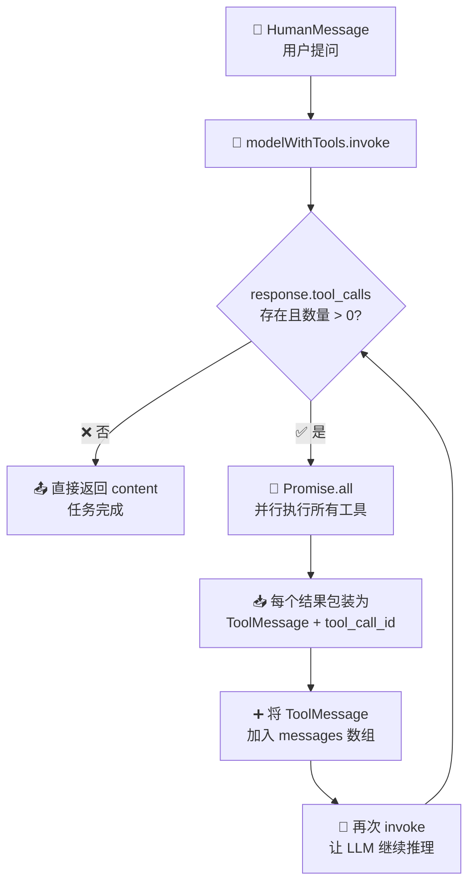
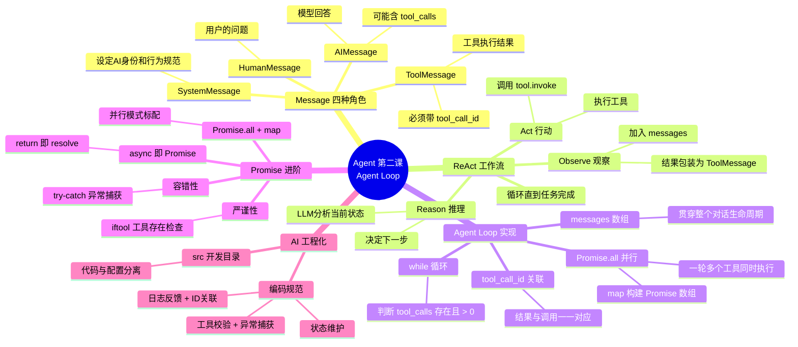

# 🤖 Agent 智能体开发实战 · 第二课：Agent Loop —— 让循环转起来

> **上节回顾**：第一课我们给 LLM 装上了"手"（Tool），但它只会"伸一次手"——返回 tool_calls 后就停了。
>
> **本课聚焦**：让 Agent **循环起来**——LLM 思考 → 调用工具 → 拿到结果 → 再思考 → 再调用…直到任务完成。同时深入理解 ReAct 工作流、四种 Message 角色、Promise 进阶用法。

---

## 📖 本课目录

- [一、上节遗留的问题：Agent 只走了一步](#一上节遗留的问题agent-只走了一步)
- [二、四种 Message 角色详解](#二四种-message-角色详解)
- [三、ReAct Agent 工作流](#三react-agent-工作流)
- [四、完整的 Agent Loop 实现](#四完整的-agent-loop-实现)
- [五、Promise 进阶：Agent 中的异步处理](#五promise-进阶agent-中的异步处理)
- [六、AI 工程化：项目结构与健壮性](#六ai-工程化项目结构与健壮性)
- [七、本课学习总结](#七本课学习总结)

---

## 一、上节遗留的问题：Agent 只走了一步

### 🔙 第一课的终点

上一课我们定义了 Tool，LLM 也返回了 `tool_calls`，但代码到这里就停了：

```javascript
// ❌ 第一课：只调用一次，没有后续
let response = await modelWithTools.invoke(messages);
messages.push(response);
// 然后呢？tool_calls 里的工具还没执行！
```

### 🎯 本课要解决的问题

一个真正能用的 Agent，必须在 LLM 返回 tool_calls 后自动执行工具，把结果喂回去，让 LLM 继续推理：

```
✅ 完整循环：
   LLM 返回 tool_calls → 执行工具 → ToolMessage 喂回 → LLM 再推理
   → 如果还有 tool_calls → 继续执行 → ... → 直到 LLM 生成最终回复
```

---

## 二、四种 Message 角色详解

在实现 Agent Loop 之前，必须先理解消息的四种角色。Agent 的整个对话上下文，就是这四种 Message 组成的数组。

| 角色 | 类名 | 方向 | 作用 |
|------|------|------|------|
| 🔵 **System** | `SystemMessage` | → LLM | 设置 AI 是谁、可以干什么、有什么能力，以及回答行为的规范 |
| 🟢 **Human** | `HumanMessage` | → LLM | 用户的问题/任务 |
| 🟡 **AI** | `AIMessage` | ← LLM | 模型的回答（可能包含 `tool_calls`） |
| 🔴 **Tool** | `ToolMessage` | → LLM | 工具执行的结果，通过 `tool_call_id` 关联到对应的 tool_call |

### 📊 消息流转示意

```
┌─────────┬──────────┬──────────┬──────────┬─────────┐
│ System  │  Human   │   AI     │  Tool    │   AI    │
│Message  │ Message  │ Message  │ Message  │ Message │
│         │          │          │          │         │
│ 设定    │  提问    │ 返回     │ 工具     │ 最终    │
│ 角色    │         │ tool_call│ 结果     │ 回复    │
└────┬────┴────┬─────┴────┬─────┴────┬─────┴────┬────┘
     │         │          │          │          │
     ▼         ▼          ▼          ▼          ▼
   messages 数组 ———— 贯穿整个对话生命周期 ————▶
```

### 💡 LangChain 对原生 OpenAI 的封装

原生 OpenAI 返回的工具调用藏在 `additional_kwargs` 里，结构嵌套深、不易读：

```json
// 原生 OpenAI 返回（难以阅读）
{
  "content": null,
  "additional_kwargs": {
    "tool_calls": [
      { "id": "call_xxx", "function": { "name": "read_file", "arguments": "..." } }
    ]
  }
}
```

LangChain 的 `invoke` 不仅原样保留了上面的数据，还**贴心地准备了一份平铺的 `tool_calls` 属性**：

```javascript
// LangChain 处理后（直接可用）
response.tool_calls  // ← 直接就是数组，每个元素有 id、name、args
```

> 🎯 这就是 LangChain 作为 LLM 工程框架的价值：**提升开发便捷性和代码可读性**，不用自己去嵌套结构里挖数据。

---

## 三、ReAct Agent 工作流

**ReAct** = **Re**asoning（推理）+ **Act**ing（行动），是 Agent 领域最经典的工作流框架。

### 🔄 ReAct 循环

```
         ┌──────────────────────────────┐
         │                              │
         ▼                              │
    ┌─────────┐    ┌─────────┐    ┌──────────┐
    │ REASON  │───▶│  ACT    │───▶│ OBSERVE  │
    │ 推理    │    │ 行动    │    │ 观察     │
    └─────────┘    └─────────┘    └──────────┘
         │                              │
         │         任务完成？            │
         └────────── 否 ────────────────┘
                    是
                    ▼
              ┌──────────┐
              │ 最终回复  │
              └──────────┘
```

### 📝 每一步的含义

| 阶段 | 英文 | 做什么 | 对应代码 |
|------|------|--------|----------|
| 🧠 **推理** | Reason | LLM 分析当前状态，决定下一步做什么 | `modelWithTools.invoke(messages)` |
| 🔧 **行动** | Act | 执行 LLM 决定调用的工具 | `tool.invoke(toolCall.args)` |
| 👁️ **观察** | Observe | 将工具执行结果作为 `ToolMessage` 加入上下文 | `messages.push(new ToolMessage(...))` |

> ⚠️ **关键理解**：ReAct 不是跑一遍就结束，而是一个**循环**。每次 Observe 之后，Agent 会带着新信息重新 Reason，直到它认为可以给出最终回复。

---

## 四、完整的 Agent Loop 实现

### 🗺️ 整体架构



### 📝 完整代码：`src/tool.mjs`

```javascript
import 'dotenv/config';
import { ChatOpenAI } from '@langchain/openai';
import { tool } from '@langchain/core/tools';
import {
  HumanMessage, // user role:'user'
  SystemMessage,
  ToolMessage,
  AIMessage
} from '@langchain/core/messages';
import fs from 'node:fs/promises';
import { z } from 'zod';  // z 提供类型约束

const model = new ChatOpenAI({
  modelName: 'deepseek-v4-flash',
  apiKey: process.env.DEEPSEEK_API_KEY,
  temperature: 0,
  configuration: {
    baseURL: 'https://api.deepseek.com/v1',
  },
});

// 📖 读文件工具
const readFileTool = tool(
  async ({ filePath }) => {   // 功能函数
    const content = await fs.readFile(filePath, 'utf-8');
    // 🔔 时刻反馈 Agent 执行消息
    // Agent 任务可能很复杂、很耗时，需要给用户反馈
    // 用户可能太久没有看到反馈，退出
    console.log(`[工具调用] read_file(${filePath})
        成功读取 ${content.length} 字节`)
    return content;
  },
  {
    name: 'read_file',
    description: `用此工具来读取文件内容，当用户要求读取文件、
        查看代码、分析文件内容时，调用此工具。输入文件路径（
        可以是相对路径或绝对路径）`,
    schema: z.object({
      filePath: z.string().describe('要读取的文件路径')
    })
  }
)

// 🔗 多个工具
const tools = [
  readFileTool
]

// 🔗 LangChain 提供了 LLM 和 Tools 注册的抽象
const modelWithTools = model.bindTools(tools);
```

### 🔄 Agent Loop 核心代码

```javascript
const messages = [
  new SystemMessage(`
        你是一个代码助手、可以使用工具读取文件并解释代码。

        工作流程：
        1. 用户要求读取文件时，立即调用 read_file 工具。
        2. 等待工具返回文件内容。
        3. 基于文件内容进行分析和解释。

        可用工具：
        - read_file: 读取文件内容(使用此工具来获取文件内容)
    `),
  new HumanMessage('请读取 src/tool.mjs 文件内容并解释代码'),
];

// 🚀 第一次调用 LLM
// 注意：变量每次调用 LLM 都会覆盖
// 如果 response 中有 tools，继续调用工具
// 如果有足够的上下文，LLM 可以直接生成最终回复
let response = await modelWithTools.invoke(messages);
messages.push(response);

// ⚡ 多个工具? 有多个任务时用 Promise.all 构建 tool promises 数组
// 每个工具执行结果，带上 tool_call_id，包装为 ToolMessage 给 messages
// 把整个 messages 数组打包给 LLM，得到最后的结果

// 🔄 核心：Agent Loop
while (response.tool_calls && response.tool_calls.length > 0) {
  // 调用工具
  console.log(`\n[检测到 ${response.tool_calls.length}]个工具调用`);

  // 🚀 Promise.all 并行执行所有工具
  const toolResults = await Promise.all(
    response.tool_calls.map(async (toolCall) => {
      // 🔍 需要检验以及准备的逻辑：找到对应的工具
      const tool = tools.find(t => t.name === toolCall.name);

      // 🛡️ 严谨性：工具不存在时的兜底处理
      if (!tool) {
        return `错误：找不到工具 ${toolCall.name}`
      }

      console.log(`[执行工具] ${toolCall.name}(
                ${JSON.stringify(toolCall.args)})`);

      // 🛡️ 容错性处理：工具执行失败时捕获异常
      try {
        const result = await tool.invoke(toolCall.args);
        return result;
      } catch (err) {
        return `错误：${err.message}`
      }
    })
  );

  // 📥 将每个工具结果包装为 ToolMessage，关联 tool_call_id
  response.tool_calls.forEach((toolCall, index) => {
    messages.push(
      new ToolMessage(
        {
          content: toolResults[index],
          tool_call_id: toolCall.id  // 🔗 id 关联：哪个任务细节由哪个工具执行
        }
      )
    )
  });

  // 🔄 再次调用 LLM，让它基于工具结果继续推理
  response = await modelWithTools.invoke(messages);
  messages.push(response);
}
```

### 🔑 关键设计点

| 设计点 | 说明 |
|--------|------|
| 🔄 **while 循环** | 只要 LLM 还返回 tool_calls，就继续执行 |
| 🔗 **tool_call_id 关联** | 每个 ToolMessage 必须带上对应的 `tool_call_id`，LLM 才能知道"这个结果是哪个工具返回的" |
| 📝 **messages 数组贯穿始终** | 整个循环操作同一条 messages，每一轮都把新消息 push 进去，构成完整上下文 |
| 🛑 **退出条件** | LLM 判断上下文已足够，不再返回 tool_calls，直接生成文本回复 |
| 🚀 **Promise.all 并行** | 一轮中的多个工具互不依赖时，并行执行 |

---

## 五、Promise 进阶：Agent 中的异步处理

Agent Loop 中大量使用异步操作，Promise 是绕不开的基础。本课在上一课的基础上进一步深入。

### 📌 async 函数的本质

```javascript
// async 函数本质上就是一个 Promise 实例
// return 相当于 resolve，return 的结果就是 Promise 的 resolve 结果
async function getWeather() {
  return { temp: 38 };  // 等价于 Promise.resolve({ temp: 38 })
}

// 所以可以这样用：
const result = await getWeather();  // { temp: 38 }

// 也可以：
getWeather().then(data => console.log(data));
```

### 📌 Promise.all + map 组合技

Agent Loop 中最常用的模式：

```javascript
// ❌ 串行：一个接一个，慢
for (const toolCall of response.tool_calls) {
  const result = await tool.invoke(toolCall.args);
}

// ✅ 并行：用 map 把每个 toolCall 变成 Promise，再用 Promise.all 统一等待
const toolResults = await Promise.all(
  response.tool_calls.map(async (toolCall) => {
    const tool = tools.find(t => t.name === toolCall.name);
    return await tool.invoke(toolCall.args);
  })
);
```

### 📌 严谨性与容错

真实环境中工具调用可能失败，Agent 代码必须具备**防御性**：

```javascript
// 🛡️ 严谨性：工具是否存在
if (!tool) {
  return `错误：找不到工具 ${toolCall.name}`;
}

// 🛡️ 容错性：工具执行可能抛异常
try {
  const result = await tool.invoke(toolCall.args);
  return result;
} catch (err) {
  return `错误：${err.message}`;
}
```

> ⚠️ **为什么要兜底？** Agent 的执行链条很长（LLM → 工具 → LLM → 工具 → …），中间任何一环崩溃，整个任务就断了。用 `try-catch` + `if` 守卫，让错误变成**可读的文本**继续传下去，LLM 看到错误信息后可以尝试换一种方式重试。

---

## 六、AI 工程化：项目结构与健壮性

### 📁 推荐工程目录

```
hello-langchain/
├── package.json          # 依赖管理
├── node_modules/         # 第三方包
└── src/                  # 📂 开发代码目录
    ├── tool.mjs          # Agent 核心逻辑
    └── node-exec.mjs     # 其他工具模块
```

> 💡 **工程规范**：业务代码放在 `src/` 下，与根目录的配置文件分离。随着 Agent 能力增长，`src/` 下会逐步加入 Memory、RAG、MCP 等模块。

### 📋 Agent 编码规范清单

| 规范 | 说明 |
|------|------|
| 🔍 **工具校验** | `tools.find(t => t.name === toolCall.name)`，确保工具存在 |
| 🛡️ **异常捕获** | `try-catch` 包裹工具执行，失败不崩溃 |
| 📝 **日志反馈** | `console.log` 实时告知用户 Agent 正在做什么 |
| 🔗 **ID 关联** | `ToolMessage` 必须带 `tool_call_id` |
| 🔄 **状态维护** | messages 数组贯穿整个循环，不丢失上下文 |

---

## 七、本课学习总结

### 🧠 思维导图



### ✅ 知识清单

| 编号 | 掌握项 | 核心要点 |
|------|--------|----------|
| 1 | 四种 Message 角色 | System / Human / AI / Tool，各司其职 |
| 2 | LangChain 对 OpenAI 的封装 | 平铺 `tool_calls`，提升可读性和开发效率 |
| 3 | ReAct 工作流 | Reason → Act → Observe 循环 |
| 4 | Agent Loop 的 while 循环 | 判断 `response.tool_calls.length > 0`，有工具就继续 |
| 5 | `tool_call_id` 关联机制 | ToolMessage 必须带上 id，LLM 才能关联结果 |
| 6 | `Promise.all` + `map` 并行模式 | 一轮中多个工具并行执行 |
| 7 | async 函数本质 | async 函数返回 Promise，return 即 resolve |
| 8 | 防御性编码 | `if (!tool)` + `try-catch`，让错误不中断流程 |
| 9 | AI 工程化意识 | src 目录分离，编码规范 |

### 📊 第一课 vs 第二课：能力对比

| 维度 | 第一课 | 第二课 |
|------|--------|--------|
| Tool 定义 | ✅ 会定义 | ✅ 会定义 |
| LLM 调用 | ✅ 单次 invoke | ✅ 循环 invoke |
| 工具执行 | ❌ 不会 | ✅ while + Promise.all |
| 结果喂回 | ❌ 不会 | ✅ ToolMessage + tool_call_id |
| ReAct 循环 | ❌ 不知道 | ✅ 理解并实现 |
| 异常处理 | ❌ 无 | ✅ try-catch + 守卫 |
| Agent 完整度 | 30% | 60% |

> 🎯 **本课成果**：你已经实现了一个**完整的 ReAct Agent**！虽然目前只有一个 `read_file` 工具，但 Loop 框架已经搭好，后续只要往 `tools` 数组里加新工具，Agent 就能自动学会使用它们。

---

*📅 2026-07-09 | 🏷️ Agent · Agent Loop · ReAct · Message · Promise · 第二课*
