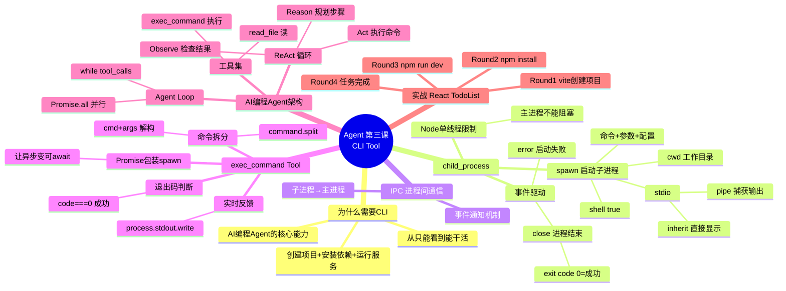

# 🤖 Agent 智能体开发实战 · 第三课：CLI Tool —— 手写 AI 编程 Agent

> **上节回顾**：第二课我们用 `while` 循环实现了完整的 Agent Loop，但工具只有一个 `read_file`——只能"看"，不能"写"，更不能"运行命令"。
>
> **本课聚焦**：给 Agent 装上 **命令行执行能力**，让它能创建项目、安装依赖、启动服务。结合文件读写，打造一个简易版的 **AI 编程 Agent**（类似 Cursor / Trae 的雏形）。

---

## 📖 本课目录

- [一、从"只能看"到"能干活"](#一从只能看到能干活)
- [二、Node.js 单线程与 child_process](#二nodejs-单线程与-child_process)
- [三、spawn 详解：Node 多进程架构](#三spawn-详解node-多进程架构)
- [四、编写 CLI 命令执行 Tool](#四编写-cli-命令执行-tool)
- [五、完整的 AI 编程 Agent](#五完整的-ai-编程-agent)
- [六、实战：让 Agent 创建一个 React TodoList 项目](#六实战让-agent-创建一个-react-todolist-项目)
- [七、本课学习总结](#七本课学习总结)

---

## 一、从"只能看"到"能干活"

### 🔙 前两课的 Agent 能力

```
第一课：LLM + Tool 定义          →  会"伸手"
第二课：Agent Loop 循环           →  会"反复伸手"
```

但现在的工具只有 `read_file`，Agent 只能**读取文件并解释代码**。真实的 AI 编程助手（如 Claude Code、Cursor、Trae）能做的是：

> 💬 "使用 Vite 创建一个 React 的 TodoList 项目，并且把它运行起来"

这个任务需要：

| 步骤 | 操作 | 需要的 Tool |
|------|------|------------|
| 1️⃣ | 用 Vite 脚手架创建项目 | **CLI 命令 Tool** ← 本课新增 |
| 2️⃣ | 编写 TodoList 组件代码 | 写入文件 Tool |
| 3️⃣ | 安装依赖 + 启动项目 | **CLI 命令 Tool** ← 本课新增 |

> 🎯 **本课目标**：让 Agent 获得**操控命令行的能力**——这是 AI 编程 Agent 的核心能力之一。

---

## 二、Node.js 单线程与 child_process

### ⚡ 为什么 CLI 命令不能直接在 Node 里执行？

Node.js 是**单线程**的，主进程负责 Agent 的思考-执行循环。如果在主进程里直接执行 `npm install` 这种耗时命令：

```
❌ 问题：
   Node 主进程 ── npm install(阻塞 2 分钟) ──▶ Agent 完全卡死
   用户看不到任何反馈，以为程序崩了
```

### 🏗️ Node 多进程架构

解决方案：利用 `child_process` 模块，把 CLI 命令**分离到独立的子进程**中去执行。

```
┌────────────────────────────────────────────┐
│              Node 主进程 (Agent)              │
│                                            │
│   LLM 推理 → Tool Call → 循环              │
│         │                                  │
│         │ 需要执行 CLI 命令                  │
│         ▼                                  │
│   ┌─────────────┐                          │
│   │ spawn() 启动 │                          │
│   └──────┬──────┘                          │
│          │                                  │
└──────────┼──────────────────────────────────┘
           │
           ▼
┌──────────────────────┐
│    子进程 (独立)       │
│                      │
│   npm init vite ...  │
│   npm install        │
│   npm run dev        │
│   ls -al             │
│   ...任何 bash 命令   │
│                      │
│   做完后 IPC 通知主进程│
└──────────────────────┘
```

> 💡 **IPC（Inter-Process Communication，进程间通信）**：子进程做完事情后，通过事件机制告诉主进程"我完成了"或"我出错了"。

### 📌 为什么 Git Bash 可以执行 Linux 命令？

Windows 上的 Git Bash 内部包含了一个**小型 Linux 系统**，所以 `ls -al`、`grep`、`chmod` 这些 bash 命令都能在 Git Bash 里运行。Agent 通过 `shell: true` 借用系统的 shell 来执行命令。

---

## 三、spawn 详解：Node 多进程架构

### 🔑 spawn 函数签名

```javascript
import { spawn } from 'node:child_process';

const child = spawn(command, args, options);
```

| 参数 | 类型 | 说明 |
|------|------|------|
| `command` | `string` | 要执行的命令，如 `'npm'` |
| `args` | `string[]` | 命令参数数组，如 `['init', 'vite', 'my-app']` |
| `options` | `object` | 配置对象（cwd、stdio、shell 等） |

### 📝 核心代码拆解：`node-exec.mjs`

```javascript
// node 主进程 agent 执行  js 单线程
// 调用工具去执行命令行任务 （分离出去，独立的子进程）
// node 多进程架构
// child_process 做完后， IPC (进程间的通信 Inner process Communication)告诉主进程

import {
  spawn // 启动一个子进程
} from 'node:child_process';

// 🎯 Agent tool, 自动化执行命令
const command = 'npm init vite react-todo-app --template react-ts';
// 切一下， 第一项 cmd , rest 运算符 所有的参数数组
const [cmd, ...args] = command.split(' ');
const cwd = process.cwd(); // 当前工作目录

// 🚀 开启子进程
const client = spawn(cmd, args, {
  cwd,          // 工作目录
  // node 运行会申请这个资源，
  // bash 也会申请这个资源，
  // 子进程继承父进程的输入输出 直接显示在当前控制台
  stdio: 'inherit',
  shell: true
});
```

### 📊 options 三要素

| 选项 | 值 | 作用 |
|------|-----|------|
| 📂 **cwd** | `process.cwd()` | 子进程的工作目录，决定命令在哪个文件夹下执行 |
| 📺 **stdio** | `'inherit'` | 子进程继承父进程的输入输出，命令的输出**直接显示在当前控制台** |
| 🐚 **shell** | `true` | 在 shell 环境中执行，支持管道、重定向等 shell 语法 |

### 📡 事件驱动：子进程的生命周期

```javascript
let errorMsg = '';

// ❌ error 事件：进程启动失败
client.on('error', (err) => {
  errorMsg = err.message
});

// 🏁 close 事件：进程结束，code 为退出码
client.on('close', (code) => {
  if (code === 0) {
    // 运行顺利，成功退出
    process.exit(0); // 退出主进程
  } else {
    if (errorMsg) {
      console.error(`错误：${errorMsg}`);
    }
    process.exit(code || 1);
  }
})
```

| 事件 | 触发时机 | 参数 |
|------|----------|------|
| 🔴 `error` | 进程启动失败（如命令不存在） | `err.message` |
| 🟢 `close` | 子进程正常结束 | `code`：0 = 成功，非 0 = 出错 |

> ⚠️ **退出码（exit code）**：`0` 表示一切正常，非 `0` 表示有错误发生。这是 Unix/Linux 的约定。

---

## 四、编写 exec-command.mjs：第一个 CLI Tool

### 🎯 创建独立的 Tool 文件

第三节的 `node-exec.mjs` 已经验证了 spawn 可以独立运行。现在把它**封装成 LangChain Tool**，创建 `src/exec-command.mjs`：

```
LLM 返回 tool_call { name: "exec_command", args: { command: "npm init vite..." } }
    ↓
Agent Loop 遍历 tools 数组，找到 exec_command
    ↓
tool.invoke(args) → spawn 启动子进程，执行命令
    ↓
返回结果 → ToolMessage → LLM 继续推理
```

### 📝 完整代码

```javascript
import { spawn } from 'node:child_process';
import { tool } from '@langchain/core/tools';
import { z } from 'zod';

// ============ 🖥️ CLI 命令执行工具 ============
const execCommandTool = tool(
  async ({ command, workDir }) => {
    // 🔪 切分命令：第一项是命令名，后面是参数
    const [cmd, ...args] = command.split(' ');

    // 📂 工作目录：默认当前目录
    const cwd = workDir || process.cwd();

    console.log(`[工具调用] exec_command: ${command}`);
    console.log(`[工作目录] ${cwd}`);

    // 🔄 用 Promise 包装 spawn 的异步事件
    return new Promise((resolve) => {
      let stdout = '';
      let stderr = '';

      // 🚀 启动子进程
      const child = spawn(cmd, args, {
        cwd,
        stdio: 'pipe',   // pipe 模式：捕获输出到变量
        shell: true,
      });

      // 📥 收集标准输出
      child.stdout.on('data', (data) => {
        stdout += data.toString();
        // 实时反馈给用户
        process.stdout.write(data);
      });

      // 📥 收集错误输出
      child.stderr.on('data', (data) => {
        stderr += data.toString();
        process.stderr.write(data);
      });

      // ❌ 启动失败
      child.on('error', (err) => {
        resolve(`❌ 命令执行失败：${err.message}`);
      });

      // 🏁 进程结束
      child.on('close', (code) => {
        if (code === 0) {
          resolve(`✅ 命令执行成功（退出码: ${code}）\n${stdout}`);
        } else {
          resolve(`❌ 命令执行失败（退出码: ${code}）\n${stderr || stdout}`);
        }
      });
    });
  },
  {
    name: 'exec_command',
    description: `执行命令行命令。当用户要求创建项目、安装依赖、
    运行服务、查看文件列表等需要执行 shell 命令时，调用此工具。
    常用命令示例：
    - 查看目录: ls -al
    - 创建Vite项目: npm init vite 项目名 --template react-ts
    - 安装依赖: npm install
    - 启动项目: npm run dev`,
    schema: z.object({
      command: z.string().describe('要执行的完整命令，如 "npm init vite my-app"'),
      workDir: z.string().optional().describe('工作目录，默认为当前目录'),
    })
  }
);

export { execCommandTool };
```

### 🔑 关键设计点

| 设计点 | 说明 |
|--------|------|
| 🔪 **命令拆分** | `command.split(' ')` → `[cmd, ...args]`，spawn 需要命令和参数分开传 |
| 📂 **工作目录** | 通过 `workDir` 参数让 LLM 指定命令在哪执行，默认 `process.cwd()` |
| 📺 **stdio: 'pipe'** | 捕获输出到变量，同时 `process.stdout.write` 实时反馈 |
| 🔄 **Promise 包装** | spawn 是事件驱动的，用 Promise 包裹让它能被 `await` |
| 🟢 **退出码判断** | `code === 0` 表示成功，非 0 表示失败 |
| 📦 **独立文件** | 工具定义独立成文件，方便维护和复用 |

---

## 五、完整的 AI 编程 Agent

### 🏗️ 架构全景

把 `read_file` 和 `exec_command` 两个工具接入 Agent Loop：

```
┌──────────────────────────────────────────────────┐
│                 🤖 AI 编程 Agent                    │
│                                                  │
│   ┌──────────┐    ┌──────────┐    ┌────────────┐ │
│   │   LLM    │    │ Agent    │    │   Tools    │ │
│   │ 大脑     │◄──►│ Loop     │◄──►│  工具箱    │ │
│   └──────────┘    └──────────┘    └────────────┘ │
│                                          │       │
│                    ┌─────────────────────┼───┐   │
│                    │                     │   │   │
│               📖 read_file    🖥️ exec_command  │
│              （第二课已有）     （本课新增）      │
│                    │                     │   │   │
│                    ▼                     ▼   │   │
│               fs.readFile         child_process │
│                                    .spawn       │
└──────────────────────────────────────────────────┘
```

### 📝 完整 Agent 代码

```javascript
import 'dotenv/config';
import { ChatOpenAI } from '@langchain/openai';
import { HumanMessage, SystemMessage, ToolMessage } from '@langchain/core/messages';
import { tool } from '@langchain/core/tools';
import { z } from 'zod';
import fs from 'node:fs/promises';
import { spawn } from 'node:child_process';

// ============ 📖 读文件工具 ============
const readFileTool = tool(
  async ({ filePath }) => {
    const content = await fs.readFile(filePath, 'utf-8');
    console.log(`[工具调用] read_file(${filePath}) 成功读取 ${content.length} 字节`);
    return content;
  },
  {
    name: 'read_file',
    description: '读取文件内容，输入文件路径',
    schema: z.object({ filePath: z.string().describe('要读取的文件路径') })
  }
);

// ============ 🖥️ CLI 命令执行工具 ============
const execCommandTool = tool(
  async ({ command, workDir }) => {
    const [cmd, ...args] = command.split(' ');
    const cwd = workDir || process.cwd();
    console.log(`[工具调用] exec_command: ${command}`);
    console.log(`[工作目录] ${cwd}`);
    return new Promise((resolve) => {
      let stdout = '', stderr = '';
      const child = spawn(cmd, args, { cwd, stdio: 'pipe', shell: true });
      child.stdout.on('data', (data) => { stdout += data.toString(); process.stdout.write(data); });
      child.stderr.on('data', (data) => { stderr += data.toString(); process.stderr.write(data); });
      child.on('error', (err) => { resolve(`❌ 命令执行失败：${err.message}`); });
      child.on('close', (code) => {
        if (code === 0) resolve(`✅ 命令执行成功（退出码: ${code}）\n${stdout}`);
        else resolve(`❌ 命令执行失败（退出码: ${code}）\n${stderr || stdout}`);
      });
    });
  },
  {
    name: 'exec_command',
    description: '执行命令行命令。创建项目、安装依赖、运行服务等。',
    schema: z.object({
      command: z.string().describe('要执行的完整命令'),
      workDir: z.string().optional().describe('工作目录，默认为当前目录'),
    })
  }
);

// 🔧 LLM 初始化
const model = new ChatOpenAI({
  modelName: 'deepseek-chat',
  apiKey: process.env.DEEPSEEK_API_KEY,
  temperature: 0,
  configuration: { baseURL: 'https://api.deepseek.com/v1' },
});

// 🔧 绑定两个工具
const tools = [readFileTool, execCommandTool];
const modelWithTools = model.bindTools(tools);

// 🚀 System Prompt + 启动
const messages = [
  new SystemMessage(`
    你是一个 AI 编程助手，拥有以下能力：
    1. 📖 read_file  — 读取文件内容
    2. 🖥️ exec_command — 执行命令行命令（创建项目、安装依赖、运行服务等）

    工作流程：
    1. 分析用户需求，制定执行计划
    2. 分步骤调用工具：先创建项目，再编写代码，最后安装运行
    3. 每步观察结果，决定下一步操作
    4. 任务完成后给出总结

    重要：执行命令后请检查退出码，确保每步都成功。
  `),
  new HumanMessage('请帮我用 Vite 创建一个 React + TypeScript 的 TodoList 项目，并运行起来'),
];

let response = await modelWithTools.invoke(messages);
messages.push(response);

// 🔄 Agent Loop
while (response.tool_calls && response.tool_calls.length > 0) {
  const toolResults = await Promise.all(
    response.tool_calls.map(async (toolCall) => {
      const tool = tools.find(t => t.name === toolCall.name);
      if (!tool) return `错误：找不到工具 ${toolCall.name}`;
      try {
        return await tool.invoke(toolCall.args);
      } catch (err) {
        return `错误：${err.message}`;
      }
    })
  );

  response.tool_calls.forEach((toolCall, index) => {
    messages.push(new ToolMessage({
      content: toolResults[index],
      tool_call_id: toolCall.id,
    }));
  });

  response = await modelWithTools.invoke(messages);
  messages.push(response);
}

console.log(`\n✅ Agent 最终回复：\n${response.content}`);
```

> 🎯 跟第二课的核心区别只有一处：`tools` 数组从一个工具变成了两个工具。Agent Loop 的 `while` 循环逻辑完全一样——这就是 LangChain 的扩展性：加能力只需要加 Tool。

### 💡 为什么 SystemMessage 也要更新？

工具多了，SystemMessage 里要告诉 LLM 新工具的存在和用法。每加一个新 Tool，System Prompt 里都要补上它的名称、用途和使用场景，否则 LLM 不知道有这个工具可用。

---

## 六、实战：让 Agent 创建一个 React TodoList 项目

### 🎬 模拟执行过程

以"创建 React TodoList 项目并运行"为例，Agent 的 ReAct 循环如下：

```
🟢 Round 1 — REASON
   用户要我创建 React TodoList 项目 → 先创建 Vite 项目骨架
                        │
                        ▼
🟡 Round 1 — ACT
   Tool: exec_command
   Args: { command: "npm init vite react-todo-app --template react-ts" }
                        │
                        ▼
🟠 Round 1 — OBSERVE
   ✅ 命令执行成功（退出码: 0）
   Scaffolding project in react-todo-app...
   Done. Now run: cd react-todo-app && npm install && npm run dev
                        │
                        ▼
🟢 Round 2 — REASON
   项目骨架已创建 → 接下来安装依赖
                        │
                        ▼
🟡 Round 2 — ACT
   Tool: exec_command
   Args: { command: "npm install", workDir: "./react-todo-app" }
                        │
                        ▼
🟠 Round 2 — OBSERVE
   ✅ 命令执行成功（退出码: 0）
   added 215 packages in 30s
                        │
                        ▼
🟢 Round 3 — REASON
   依赖已安装 → 启动开发服务器
                        │
                        ▼
🟡 Round 3 — ACT
   Tool: exec_command
   Args: { command: "npm run dev", workDir: "./react-todo-app" }
                        │
                        ▼
🟠 Round 3 — OBSERVE
   ✅ 命令执行成功（退出码: 0）
   VITE v5.0.0  ready in 300ms
   ➜  Local:   http://localhost:5173/
                        │
                        ▼
🟢 Round 4 — REASON (FINAL)
   项目已成功运行在 http://localhost:5173/，任务完成！
```

### 🛠️ exec_command 的典型用法

LLM 会在以下场景自动调用 `exec_command`：

| 场景 | 命令示例 |
|------|----------|
| 📋 查看目录结构 | `ls -al` |
| 🏗️ 创建 Vite 项目 | `npm init vite my-app --template react-ts` |
| 📦 安装依赖 | `npm install` |
| 🚀 启动开发服务器 | `npm run dev` |
| 🔍 检查 Node 版本 | `node --version` |
| 🧹 清理构建产物 | `rm -rf dist` |

---

## 七、本课学习总结

### 🧠 思维导图



### ✅ 知识清单

| 编号 | 掌握项 | 核心要点 |
|------|--------|----------|
| 1 | 为什么需要 child_process | Node 单线程不能阻塞，CLI 命令必须分离到子进程 |
| 2 | `spawn` 函数用法 | `spawn(cmd, args, { cwd, stdio, shell })` |
| 3 | `command.split` 拆分技巧 | `const [cmd, ...args] = command.split(' ')` |
| 4 | `stdio: 'inherit'` vs `'pipe'` | inherit 直接显示控制台 / pipe 捕获到变量 |
| 5 | IPC 进程间通信 | 子进程通过 `error`/`close` 事件通知主进程 |
| 6 | exit code 退出码 | `0` = 成功，非 `0` = 失败 |
| 7 | Promise 包装 spawn | 事件驱动 → Promise，适配 Agent Loop 的 await 模式 |
| 8 | exec_command Tool 定义 | name + description + schema，让 LLM 会调用 |
| 9 | AI 编程 Agent 完整架构 | `LLM + Loop + [read_file, exec_command]` |
| 10 | ReAct 多轮实战流程 | 创建项目 → 安装依赖 → 运行服务 → 完成 |

### 📊 三课能力进化

| 维度 | 第一课 | 第二课 | 第三课 |
|------|--------|--------|--------|
| 核心能力 | Tool 定义 | Agent Loop | CLI 执行 |
| 工具数量 | 1 个 | 1 个 | **2 个** |
| 能做什么 | 读文件 | 读文件+循环 | **创建项目+执行命令** |
| 技术栈 | LangChain Tool | while + ReAct | **child_process** |
| Agent 完整度 | 30% | 60% | **80%** |

> 🎯 **本课成果**：Agent 从"只能读文件"升级为"能读文件 + 能执行命令"。这就是 Cursor/Trae/Claude Code 的雏形！

---

*📅 2026-07-10 | 🏷️ Agent · CLI Tool · child_process · spawn · AI编程 · 第三课*
