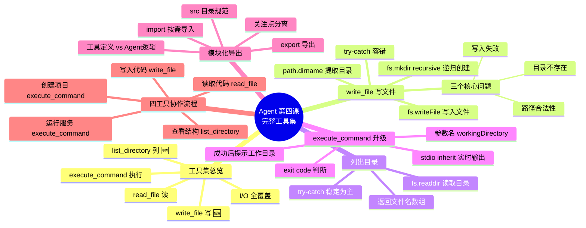

# 🤖 Agent 智能体开发实战 · 第四课：完整工具集 —— 打造 AI 编程 Agent 的工具箱

> **上节回顾**：第三课我们给 Agent 加上了 CLI 命令执行能力，让它能创建项目、运行命令。但一个真正的 AI 编程 Agent 还需要更多工具。
>
> **本课聚焦**：构建一套完整的 **I/O 工具集** —— 读文件、写文件、列目录、执行命令。四个工具各司其职，让 Agent 具备完整的文件操作和命令行操控能力。

---

## 📖 本课目录

- [一、从单个工具到工具箱](#一从单个工具到工具箱)
- [二、write_file：写入文件 Tool](#二write_file写入文件-tool)
- [三、list_directory：列出目录 Tool](#三list_directory列出目录-tool)
- [四、execute_command：升级版 CLI Tool](#四execute_command升级版-cli-tool)
- [五、工具模块化导出](#五工具模块化导出)
- [六、四工具能力矩阵](#六四工具能力矩阵)
- [七、本课学习总结](#七本课学习总结)

---

## 一、从单个工具到工具箱

### 🔙 前三课的演进

```
第一课：1 个工具 (read_file)       →  只能"看"
第二课：1 个工具 + Agent Loop      →  会"反复看"
第三课：2 个工具 (read + exec)     →  能"看"能"执行命令"
```

所以一个完整的 AI 编程 Agent 需要四个动作：

| 动作 | 工具 | 本课状态 |
|------|------|----------|
| 📖 读 | `read_file` | 已有（保留） |
| ✍️ 写 | `write_file` | 🆕 本课新增 |
| 📋 列 | `list_directory` | 🆕 本课新增 |
| 🖥️ 执行 | `execute_command` | 升级优化（第三课版本基础上） |

> 🎯 **本课目标**：把四个工具封装成**可复用的模块**（`all-tools.mjs`），通过 `export` 导出，下一课 `mini-cursor.mjs` 直接 `import` 使用——这就是**关注点分离**的工程实践。

---

## 二、write_file：写入文件 Tool

### 🎯 为什么需要 write_file？

LLM 可以生成代码，但如果不能写入文件，生成的代码就只是"聊天记录"。`write_file` 让 Agent 能**把 LLM 生成的代码真正写到项目文件里**。

### ⚠️ 三个核心问题

| 问题 | 解决方案 |
|------|----------|
| 目标目录不存在怎么办？ | `fs.mkdir(dir, { recursive: true })` 递归创建 |
| 路径是否合法？ | `path.dirname()` + `path.join()` 确保路径安全 |
| 写入失败怎么办？ | `try-catch` 兜底，返回错误信息而不是崩溃 |

### 📝 完整代码

```javascript
// 写文件
const writeFileTool = tool(
  // path 模块 专门的路径模块 Agent执行正确服务
  // path 路径  /src/all-tool.mjs 路径模块
  async ({ filePath, content }) => {
    // 1. 确认路径是否在当前工作目录下
    // 2. 写入文件， utf-8
    // 3. 容错处理
    try {
      const dir = path.dirname(filePath);
      console.log(dir, '目录');
      // 已存在 目录不创建
      // 递归创建 /a/b/c/123.js
      await fs.mkdir(dir, { recursive: true });
      // 写入文件
      await fs.writeFile(filePath, content, 'utf-8');
      console.log(`[工具调用] write_file(${filePath})
            成功写入 ${content.length} 字节`)
      return `成功写入 ${filePath}`
    } catch (err) {
      console.log(`[工具调用] write_file(${filePath})
            错误： ${err.message}`)
      return `写入文件失败：${err.message}`
    }
  },
  {
    name: 'write_file',
    description: '向指定路径写入文件内容，自动创建目录',
    schema: z.object({
      filePath: z.string().describe('文件路径'),
      content: z.string().describe('要写入的文件内容')
    })
  }
)
```

### 🔑 关键知识点：`path` 模块 + `fs.mkdir`

```javascript
import path from 'node:path'; // node 内置的 path 模块
import fs from 'node:fs/promises';

// path.dirname：提取目录部分
path.dirname('src/components/App.tsx');  // → 'src/components'

// fs.mkdir + recursive：递归创建多层目录
await fs.mkdir('src/components', { recursive: true });
// 即使 src/ 不存在，也会自动逐层创建
// 如果目录已存在，不会报错，直接跳过
```

> 💡 **为什么用 `recursive: true`？** Agent 写入文件时，目标路径的父目录可能还不存在。`recursive` 保证整个目录树自动创建，相当于 `mkdir -p`。

---

## 三、list_directory：列出目录 Tool

### 🎯 为什么需要 list_directory？

Agent 操作文件前需要**了解项目结构**。比如用户说"修改 src/App.tsx"，Agent 应该先 `list_directory` 看看 src 下有什么文件，确认文件存在。

### 📝 完整代码

```javascript
// 列出目录内容工具
const listDirectoryTool = tool(
  async ({ directoryPath }) => {
    // 后端以稳定为主
    try {
      // 列出目录下的所有文件和文件夹
      const files = await fs.readdir(directoryPath);
      console.log(`[工具调用] list_directory(${directoryPath})
            成功列出 ${files.length} 个文件和文件夹`)
      return `目录内容：\n ${files.map(file => file.name).join('\n')}`
    } catch (err) {
      console.log(`[工具调用] list_directory(${directoryPath})
            错误： ${err.message}`)
      return `列出目录内容失败：${err.message}`
    }
  },
  {
    name: 'list_directory',
    description: '列出指定目录下的所有文件和文件夹',
    schema: z.object({
      directoryPath: z.string().describe('目录路径')
    })
  }
)
```


---

## 四、execute_command：升级版 CLI Tool

相比第三课 `node-exec.mjs` 中的原始版本，这一版 `execute_command` 做了三个升级：

| 改进 | 第三课的版本 | 第四课（all-tools.mjs） |
|------|--------------|------------------------|
| 参数名 | 无（硬编码 command） | `workingDirectory`（LLM 可指定） |
| 工作目录 | `process.cwd()` 固定 | 参数化，支持任意目录 |
| 成功后提示 | 无 | **带工作目录提示**，让 LLM 知道命令在哪执行 |
| stdio 模式 | `inherit`（直接显示，不捕获） | `inherit`（直接显示，实时反馈） |
| 封装级别 | 裸 spawn 脚本 | LangChain Tool，可被 LLM 调用 |

### 📝 完整代码

```javascript
// 执行命令工具（带实时输出）
const executeCommandTool = tool(
  async ({ command, workingDirectory }) => {
    const cwd = workingDirectory || process.cwd();
    console.log(`[工具调用] execute_command(${command})
        工作目录：${cwd}`);
    return new Promise((resolve, reject) => {
      const [cmd, ...args] = command.split(' ');
      const child = spawn(cmd, args, {
        cwd,
        stdio: 'inherit',
        shell: true,
      })
      let errorMsg = '';
      child.on('error', (err) => {
        errorMsg = err.message
      });
      child.on('close', (code) => {
        if (code === 0) { // 运行顺利，成功退出
          console.log(`[工具调用] execute_command(${command})
                   成功执行`)
          const cwdInfo = workingDirectory ?
            `\n\n重要提示：命令在目录"${workingDirectory}" 执行`
            : '';
          resolve(`命令行执行成功 ${command}${cwdInfo}`);
        } else {
          console.log(`[工具调用] execute_command(${command})
                    退出码：${code}`)
          resolve(`命令执行失败，退出码：${code}\n 错误：${errorMsg}`)
        }
      })
    })
  },
  {
    name: 'execute_command',
    description: '执行系统命令，支持指定工作目录，实时显示输出',
    schema: z.object({
      command: z.string().describe('要执行的命令'),
      workingDirectory: z.string().describe('工作目录(推荐指定)')
    })
  }
)
```

> 💡 **关键改进**：成功后返回 `重要提示：命令在目录"xxx"执行`，这能帮助 LLM 理解命令的上下文，避免下一步出错（比如重复 `cd`）。

---

## 五、工具模块化导出

### 📦 为什么要模块化？

前三课的工具代码和 Agent Loop 混在一个文件里。当工具数量变多、Agent 逻辑变复杂时，**必须分离**。

```
src/
├── all-tools.mjs    ← 📦 工具箱（本课产物）
└── mini-cursor.mjs  ← 🤖 Agent 主程序（下一课使用）
```

### 📝 导出模式

```javascript
export {
  readFileTool,
  writeFileTool,
  listDirectoryTool,
  executeCommandTool
}
```

其他文件直接按需导入：

```javascript
import {
  executeCommandTool,
  readFileTool,
  writeFileTool,
  listDirectoryTool
} from './all-tools.mjs';
```

> 🎯 这是**关注点分离**的工程实践：工具的定义和 Agent 的运行逻辑分开，各自独立维护，互相不干扰。

---

## 六、四工具能力矩阵

### 📊 全景对比

| 工具 | 操作对象 | 核心 API | 输出 | 用途 |
|------|----------|----------|------|------|
| 📖 `read_file` | 文件 | `fs.readFile` | 文件内容 | 读取代码、分析文件 |
| ✍️ `write_file` | 文件 | `fs.mkdir` + `fs.writeFile` | 成功/失败信息 | 写入 LLM 生成的代码 |
| 📋 `list_directory` | 目录 | `fs.readdir` | 文件列表 | 了解项目结构 |
| 🖥️ `execute_command` | 系统 | `spawn` | 退出码 + 输出 | 创建项目、安装依赖、运行服务 |

### 🔗 工具协作流程

```
LLM 接到任务"创建 React 项目并写一个组件"
         │
         ▼
┌─────────────────────────────────────────┐
│  Step 1: execute_command                │
│  "npm init vite my-app --template react"│
│  创建项目骨架                            │
├─────────────────────────────────────────┤
│  Step 2: list_directory                 │
│  "src/"                                 │
│  看看 src 下有哪些文件                    │
├─────────────────────────────────────────┤
│  Step 3: read_file                      │
│  "src/App.tsx"                          │
│  读取现有的 App 组件代码                  │
├─────────────────────────────────────────┤
│  Step 4: write_file                     │
│  "src/App.tsx" + TodoList 代码           │
│  覆盖写入新的组件代码                     │
├─────────────────────────────────────────┤
│  Step 5: execute_command                │
│  "npm run dev", workingDirectory="my-app"│
│  启动开发服务器                           │
└─────────────────────────────────────────┘
```

> 🎯 四个工具覆盖了文件操作的完整生命周期：**创建 → 查看 → 读取 → 修改 → 运行**。

---

## 七、本课学习总结

### 🧠 思维导图



### ✅ 知识清单

| 编号 | 掌握项 | 核心要点 |
|------|--------|----------|
| 1 | `write_file` Tool | `path.dirname` + `fs.mkdir({recursive})` + `fs.writeFile` + try-catch |
| 2 | `path` 模块 | `path.dirname()` 提取目录、`path.join()` 拼接路径 |
| 3 | `fs.mkdir` recursive | 递归创建多层目录，目录已存在不报错 |
| 4 | `list_directory` Tool | `fs.readdir` 读取目录，返回文件名列表 |
| 5 | `execute_command` 升级 | `workingDirectory` 参数 + 成功后提示工作目录 |
| 6 | `stdio: 'inherit'` vs `'pipe'` | inherit 直接显示控制台 / pipe 捕获到变量 |
| 7 | 模块化导出 `export` | 工具定义独立文件，按需 `import` |
| 8 | 四工具协作流程 | 创建→查看→读取→修改→运行，覆盖文件全生命周期 |
| 9 | 工具设计原则 | 容错兜底 + 日志反馈 + 描述清晰 + schema 严格 |

### 📊 四课能力进化

| 维度 | 第一课 | 第二课 | 第三课 | 第四课 |
|------|--------|--------|--------|--------|
| 核心能力 | Tool 定义 | Agent Loop | CLI 执行 | **完整工具集** |
| 工具数量 | 1 | 1 | 2 | **4** |
| 代码组织 | 单文件 | 单文件 | 单文件 | **模块化导出** |
| 能做什么 | 读文件 | 循环读 | 读+执行命令 | **读+写+列+执行** |
| Agent 完整度 | 30% | 60% | 80% | **90%** |

> 🎯 **本课成果**：四工具模块化工具箱就绪！`all-tools.mjs` 覆盖了文件操作的完整生命周期（创建→查看→读取→修改→运行）。更重要的是，通过 `export` 导出实现了**工具定义与 Agent 逻辑的分离**，下一课 `mini-cursor.mjs` 只需 `import` 就能用。

---

*📅 2026-07-10 | 🏷️ Agent · ToolSet · write_file · list_directory · 模块化 · 第四课*
